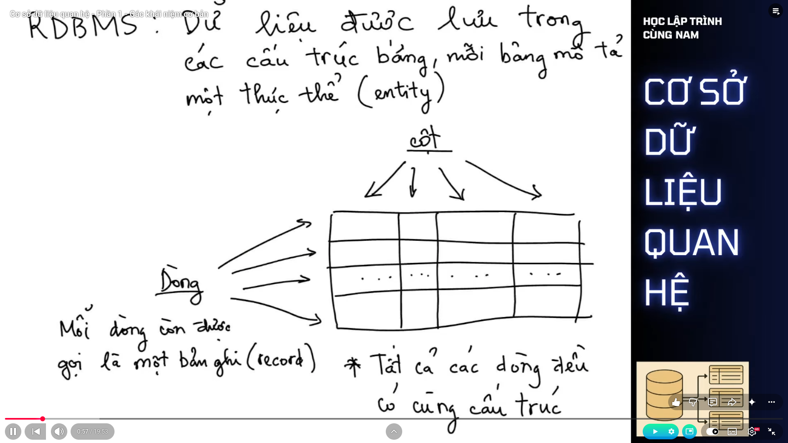
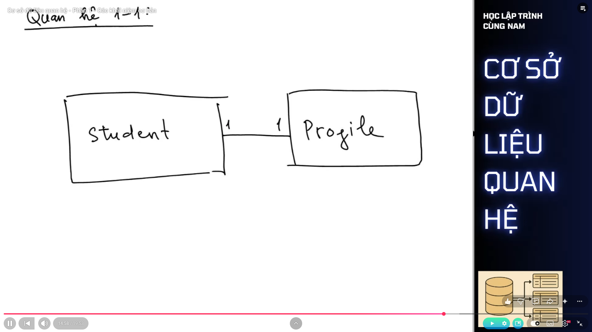
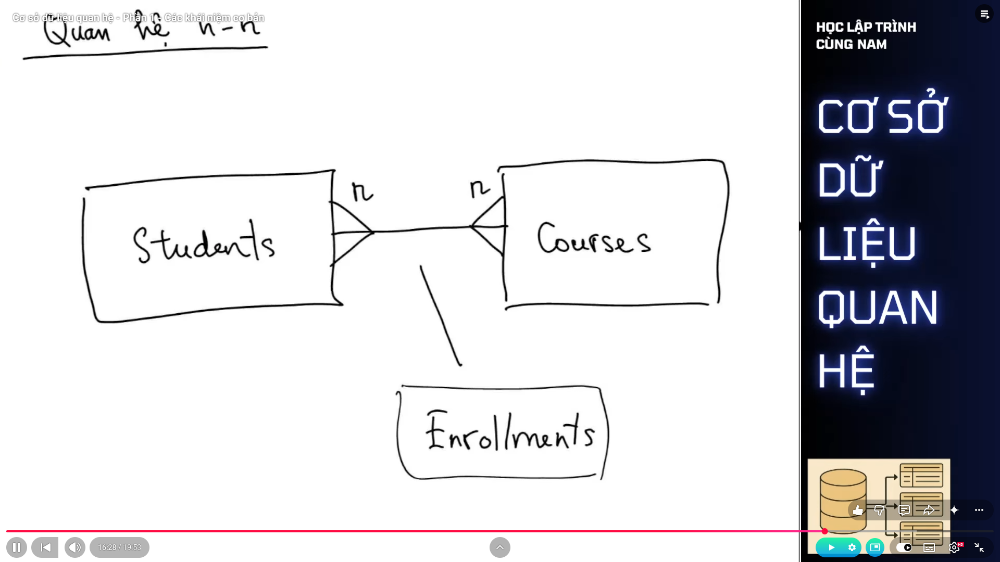

# Part 1: Các Khái Niệm Cơ Bản Trong CSDL Quan Hệ - Basic Concepts

## 1. Giới thiệu về Cơ sở dữ liệu quan hệ (RDBMS)



### 1.1 Khái niệm CSDL quan hệ

**Cơ sở dữ liệu quan hệ** (**Relational Database**) là mô hình tổ chức dữ liệu dựa trên mô hình toán học quan hệ (do Edgar F. Codd đề xuất vào năm 1970). Trong mô hình này, toàn bộ dữ liệu được tổ chức và lưu trữ dưới dạng các **bảng** (**tables**) có mối liên kết logic chặt chẽ với nhau thông qua các trường dữ liệu chung.

Hệ thống phần mềm giúp người dùng định nghĩa, tạo lập, truy vấn, cập nhật và quản trị cơ sở dữ liệu quan hệ được gọi là **hệ quản trị cơ sở dữ liệu quan hệ** (**Relational Database Management System - RDBMS**). Một số RDBMS phổ biến hàng đầu hiện nay gồm có: **Microsoft SQL Server**, **PostgreSQL**, **MySQL**, **Oracle Database** và **SQLite**.

### 1.2 Tại sao CSDL quan hệ vẫn thống trị?

Trải qua hàng chục năm phát triển, mặc dù đã xuất hiện nhiều mô hình cơ sở dữ liệu phi quan hệ mới (**NoSQL**, **Document Database**, **Graph Database**, **Key-Value Store**), nhưng CSDL quan hệ vẫn là lựa chọn ưu tiên hàng đầu cho hầu hết các hệ thống doanh nghiệp nhờ vào:

- **Tính toàn vẹn dữ liệu** (**Data Integrity**): Đảm bảo dữ liệu không bị sai lệch, mâu thuẫn nhờ hệ thống ràng buộc chặt chẽ (**Constraints**).
- **Tính chuẩn xác và tuân thủ ACID**: Đảm bảo các giao dịch (**Transactions**) diễn ra an toàn (Nguyên tử, Nhất quán, Cô lập, Bền vững).
- **Khả năng mô hình hóa nghiệp vụ thực tế**: Thế giới thực vốn bao gồm các thực thể có mối quan hệ đa chiều với nhau, mô hình quan hệ phản ánh cấu trúc này một cách tự nhiên và chính xác nhất.
- **Ngôn ngữ truy vấn chuẩn hóa** (**Structured Query Language - SQL**): Cung cấp cú pháp khai báo mạnh mẽ, linh hoạt để xử lý và phân tích dữ liệu phức tạp.

---

## 2. Cấu trúc dữ liệu trong RDBMS

Trong CSDL quan hệ, dữ liệu không nằm rải rác mà được phân loại rõ ràng thành các cấp độ từ tổng quan đến chi tiết:

```
[Database]
   └── [Table] (Thực thể: Customers, Orders, Products...)
         ├── [Columns / Fields] (Thuộc tính: ID, Name, Price...)
         └── [Rows / Records]   (Bản thể cụ thể: 1 khách hàng, 1 đơn hàng...)
```

### 2.1 Thực thể (Entity)

- **Thực thể** (**Entity**) là một đối tượng, khái niệm hoặc sự vật trong thế giới thực mà hệ thống cần quản lý và lưu trữ thông tin.
- _Ví dụ:_ Trong hệ thống thương mại điện tử, các thực thể bao gồm: `Khách hàng` (`Customer`), `Đơn hàng` (`Order`), `Sản phẩm` (`Product`), `Nhân viên` (`Employee`).
- Quá trình phân tích hệ thống sẽ xác định hệ thống có những thực thể nào và mối quan hệ qua lại giữa chúng ra sao.

### 2.2 Bảng (Table)

- **Bảng** (**Table**, hoặc thuật ngữ toán học gọi là **Quan hệ - Relation**) là cấu trúc 2 chiều gồm các hàng và các cột, dùng để lưu trữ tập hợp tất cả các thể hiện của một thực thể cụ thể.
- Tên bảng thường được đặt theo dạng danh từ số nhiều hoặc danh từ chỉ thực thể (ví dụ: `Customers`, `Orders`, `Products`).

### 2.3 Cột (Column / Attribute) & Kiểu dữ liệu (Data Type)

- Mỗi **cột** (**column**, còn gọi là **thuộc tính** (**attribute**) hay **trường** (**field**)) đại diện cho một đặc điểm, tính chất cụ thể của thực thể cần lưu trữ.
- _Ví dụ:_ Trong bảng `Orders`, các cột có thể là `order_id`, `customer_id`, `order_date`, `ship_address`.
- **Kiểu dữ liệu** (**Data Type**): Mỗi cột bắt buộc phải gắn liền với một kiểu dữ liệu cố định xác định trước:
  - Kiểu số nguyên: `INT`, `BIGINT`, `SMALLINT`.
  - Kiểu chuỗi ký tự: `VARCHAR`, `NVARCHAR` (hỗ trợ Unicode tiếng Việt), `CHAR`, `TEXT`.
  - Kiểu ngày giờ: `DATETIME2`, `DATE`, `TIMESTAMP`.
  - Kiểu số thập phân / tiền tệ: `DECIMAL`, `NUMERIC` (tránh dùng `FLOAT`/`REAL` cho dữ liệu tài chính vì sai số dấu phẩy động).

### 2.4 Hàng (Row / Record / Tuple)

- Mỗi **hàng** (**row**, còn gọi là **bản ghi** (**record**) hay **bộ dữ liệu** (**tuple**)) đại diện cho một đối tượng đơn lẻ cụ thể của thực thể đó trong thực tế.
- _Ví dụ:_ Trong bảng `Customers`, một hàng là toàn bộ thông tin về khách hàng "Nguyễn Văn A" (bao gồm ID, Họ tên, Email, Số điện thoại).

### 2.5 Tính nhất quán của lược đồ (Schema Consistency)

Một đặc trưng cơ bản của RDBMS là tính chặt chẽ về mặt cấu trúc:

- Tất cả các dòng trong cùng một bảng **bắt buộc** phải có số lượng cột như nhau và tuân thủ đúng kiểu dữ liệu đã được định nghĩa tại cột đó.
- Không thể có trường hợp dòng thứ nhất có 5 cột, dòng thứ hai tự ý thêm cột thứ 6 hoặc một cột lúc lưu chuỗi, lúc lưu số. Mọi thay đổi về cấu trúc đều phải thông qua việc thay đổi định nghĩa bảng (**DDL - Data Definition Language**).

---

## 3. Giá trị NULL và Ràng buộc NOT NULL

### 3.1 Bản chất của giá trị NULL

- **Giá trị NULL** (**NULL value**) đại diện cho trạng thái **không xác định**, **chưa biết** (**unknown**) hoặc **dữ liệu bị thiếu** (**missing value**).
- > [!IMPORTANT]
  > **NULL không tương đương với số 0, cũng không tương đương với chuỗi rỗng `""` (empty string).**
  >
  > - Số `0` là một giá trị số cụ thể (ví dụ: số dư tài khoản = 0đ).
  > - Chuỗi rỗng `""` là một chuỗi có độ dài bằng 0 (đã biết giá trị là không có ký tự nào).
  > - `NULL` có nghĩa là "chưa có thông tin" hoặc "thông tin không áp dụng". Ví dụ: Khách hàng chưa cập nhật số điện thoại bàn hoặc người dùng chưa kết hôn thì cột `spouse_name` mang giá trị `NULL`.

### 3.2 Quy tắc thiết kế NULL và NOT NULL

Khi khai báo các cột trong bảng, nhà phát triển cơ sở dữ liệu phải quyết định quy tắc chấp nhận dữ liệu cho từng cột:

- **Ràng buộc bắt buộc** (**NOT NULL constraint**): Cột không được phép để trống. Khi thêm mới (`INSERT`) hoặc cập nhật (`UPDATE`), nếu không truyền giá trị cho cột này, hệ thống sẽ báo lỗi và từ chối thao tác.
  - Áp dụng cho: Mã định danh, họ tên chính, email đăng nhập, giá tiền sản phẩm, ngày tạo đơn...
- **Cho phép để trống** (**NULL constraint**): Cột có thể nhận giá trị `NULL` nếu người dùng chưa cung cấp hoặc thông tin là tùy chọn.
  - Áp dụng cho: Địa chỉ phụ, số fax, ghi chú đơn hàng, ngày kết thúc công việc (đối với nhân viên đang làm việc)...

```sql
-- Minh họa bảng Customers với quy chuẩn ràng buộc NULL / NOT NULL
CREATE TABLE dbo.Customers (
    customer_id   INT IDENTITY(1,1) NOT NULL, -- Bắt buộc: Khóa chính định danh
    first_name    NVARCHAR(50)      NOT NULL, -- Bắt buộc: Tên khách hàng
    last_name     NVARCHAR(50)      NOT NULL, -- Bắt buộc: Họ khách hàng
    email         VARCHAR(100)      NOT NULL, -- Bắt buộc: Thông tin liên lạc định danh
    phone_number  VARCHAR(20)       NULL,     -- Tùy chọn: Có thể chưa cung cấp lúc đăng ký
    address_line2 NVARCHAR(100)     NULL      -- Tùy chọn: Địa chỉ phụ (căn hộ, tòa nhà)
);
```

---

## 4. Các Loại Khóa trong CSDL Quan Hệ (Keys in Relational Database)

Khóa là thành phần cốt lõi nhất để đảm bảo mỗi bản thể trong bảng có thể được truy xuất chính xác mà không bao giờ bị nhầm lẫn.

```
┌─────────────────────────────────────────────────────────┐
│                    Super Key (Khóa siêu)                │
│   ┌─────────────────────────────────────────────────┐   │
│   │        Candidate Key (Khóa ứng viên)            │   │
│   │   ┌───────────────────────┐                     │   │
│   │   │  Primary Key (Chính)  │   Alternate Key     │   │
│   │   │                       │   (Khóa thay thế)   │   │
│   │   └───────────────────────┘                     │   │
│   └─────────────────────────────────────────────────┘   │
└─────────────────────────────────────────────────────────┘
```

### 4.1 Khóa siêu (Super Key)

- **Khóa siêu** (**Super Key**) là một cột đơn lẻ hoặc một tập hợp nhiều cột kết hợp lại sao cho giá trị của chúng có thể định danh **duy nhất** một dòng trong bảng.
- Một bảng có thể có rất nhiều Super Key.
- _Ví dụ:_ Trong bảng Sinh viên có các cột `(student_id, citizen_id, email, full_name, birth_date)`. Các Super Key có thể là:
  - `{student_id}`
  - `{citizen_id}`
  - `{email}`
  - `{student_id, full_name}` (thừa `full_name` nhưng vẫn xác định duy nhất được dòng)
  - `{student_id, citizen_id, email}` (chứa nhiều thuộc tính thừa)

### 4.2 Khóa ứng viên (Candidate Key)

- **Khóa ứng viên** (**Candidate Key**) là một **Khóa siêu tối thiểu** (**Minimal Super Key**). Nghĩa là nó có khả năng xác định duy nhất một dòng, và **không chứa bất kỳ thuộc tính dư thừa nào**. Nếu loại bỏ bất kỳ cột nào ra khỏi Candidate Key, nó sẽ mất đi khả năng định danh duy nhất.
- Trong ví dụ trên, `{student_id}`, `{citizen_id}` và `{email}` là các Candidate Key. Trong khi đó, `{student_id, full_name}` không phải là Candidate Key vì nếu bỏ `full_name` ra thì `{student_id}` đứng một mình vẫn định danh duy nhất được bản ghi.

### 4.3 Khóa chính (Primary Key - PK)

- **Khóa chính** (**Primary Key - PK**) là **một Candidate Key duy nhất** được người thiết kế cơ sở dữ liệu chọn ra để làm mã định danh chính thức và đại diện cho bảng đó.
- Các Candidate Key còn lại không được chọn làm khóa chính sẽ được gọi là **khóa thay thế** (**Alternate Key**) hoặc được cài đặt dưới dạng **ràng buộc duy nhất** (**UNIQUE constraint**).
- **2 Đặc tính bất biến của Khóa chính:**
  1. **Tính duy nhất** (**Uniqueness**): Không bao giờ được phép có hai dòng trùng nhau về giá trị khóa chính.
  2. **Không được rỗng** (**NOT NULL**): Giá trị của khóa chính luôn luôn phải xác định, không bao giờ được phép mang giá trị `NULL`.

> [!TIP]
> **Surrogate Key vs Natural Key:**
>
> - **Khóa tự nhiên** (**Natural Key**): Sử dụng dữ liệu thực tế của nghiệp vụ làm khóa (ví dụ: Số CCCD `citizen_id`, mã số thuế). Điểm yếu là thông tin nghiệp vụ có thể thay đổi hoặc có độ dài chuỗi lớn làm giảm hiệu năng JOIN.
> - **Khóa nhân tạo / Khóa đại diện** (**Surrogate Key**): Sử dụng một cột số nguyên tự tăng (ví dụ: `IDENTITY(1,1)` trong SQL Server hoặc `BIGSERIAL` / `GENERATED ALWAYS AS IDENTITY` trong PostgreSQL) để làm khóa chính. Đây là thực hành phổ biến giúp tối ưu tốc độ lập chỉ mục và liên kết bảng.

### 4.4 Khóa phức hợp (Composite Key)

- **Khóa phức hợp** (**Composite Primary Key**) là khóa chính được tạo thành từ **hai hoặc nhiều cột kết hợp lại** mới đủ điều kiện để định danh duy nhất một bản ghi.
- Từng cột đơn lẻ trong khóa phức hợp có thể trùng lặp, nhưng sự kết hợp giữa các giá trị của chúng trên một dòng thì luôn luôn là duy nhất.
- Khóa phức hợp thường xuất hiện trong các bảng ghi nhận sự kiện giao dịch hoặc bảng trung gian liên kết giữa hai thực thể.

```sql
-- Ví dụ: Bảng OrderDetails có khóa chính phức hợp gồm (order_id, product_id)
CREATE TABLE dbo.OrderDetails (
    order_id    INT           NOT NULL, -- Mã đơn hàng
    product_id  INT           NOT NULL, -- Mã sản phẩm
    quantity    INT           NOT NULL, -- Số lượng mua
    unit_price  DECIMAL(18,2) NOT NULL, -- Đơn giá tại thời điểm đặt hàng
    CONSTRAINT PK_OrderDetails PRIMARY KEY (order_id, product_id)
    -- WHY: Một đơn hàng có thể có nhiều sản phẩm, một sản phẩm có thể nằm trong nhiều đơn hàng.
    -- Sự kết hợp giữa order_id và product_id là duy nhất trong từng đơn hàng.
);
```

---

## 5. Khóa Ngoại và Ràng buộc Toàn vẹn Tham chiếu

### 5.1 Khóa ngoại (Foreign Key - FK)

- **Khóa ngoại** (**Foreign Key - FK**) là một cột hoặc nhóm cột trong một bảng, dùng để **tham chiếu** (**reference**) đến **Khóa chính** (**Primary Key**) (hoặc Unique Key) của một bảng khác (hoặc chính bảng đó).
- Khóa ngoại là chiếc cầu nối thiết lập mối quan hệ logic giữa các bảng trong cơ sở dữ liệu quan hệ.

### 5.2 Mối quan hệ Bảng cha (Parent) và Bảng con (Child)

- **Bảng cha** (**Parent Table / Referenced Table**): Là bảng nắm giữ khóa chính được tham chiếu đến.
- **Bảng con** (**Child Table / Referencing Table**): Là bảng chứa cột khóa ngoại trỏ về bảng cha.
- _Ví dụ:_ Bảng `Customers` là bảng cha (chứa `customer_id` làm PK), bảng `Orders` là bảng con (chứa `customer_id` làm FK).

```
   [Bảng Cha: Customers]                     [Bảng Con: Orders]
┌─────────────────────────┐               ┌──────────────────────────────┐
│ PK: customer_id         │◄──────────────│ FK: customer_id              │
│     first_name          │  (Tham chiếu) │     order_id (PK)            │
│     last_name           │               │     order_date               │
└─────────────────────────┘               └──────────────────────────────┘
```

### 5.3 Ràng buộc toàn vẹn tham chiếu (Referential Integrity)

**Ràng buộc toàn vẹn tham chiếu** (**Referential Integrity Constraint**) là cơ chế tự động của RDBMS để đảm bảo mối liên kết giữa các bảng luôn hợp lệ và nhất quán:

1. **Ràng buộc khi Thêm/Sửa ở bảng con (`INSERT` / `UPDATE`)**:
   - Giá trị nhập vào cột khóa ngoại ở bảng con bắt buộc phải **đang tồn tại** trong cột khóa chính của bảng cha (hoặc phải mang giá trị `NULL` nếu cột FK cho phép null).
   - Hệ thống sẽ chặn ngay lập tức nếu bạn cố gắng tạo một đơn hàng cho một `customer_id = 999` chưa hề có trong bảng `Customers`.
2. **Ràng buộc khi Xóa/Sửa ở bảng cha (`DELETE` / `UPDATE`)**:
   - Không thể xóa một khách hàng ở bảng cha nếu đang còn các đơn hàng trong bảng con trỏ đến khách hàng đó.
   - Tránh triệt để tình trạng sinh ra **dữ liệu mồ côi** (**Orphan Records** - tức các dòng ở bảng con trỏ vào hư không).

> [!NOTE]
> **Các hành vi xử lý khi bảng cha bị xóa (`ON DELETE`):**
>
> - `ON DELETE NO ACTION` / `RESTRICT`: Mặc định, chặn hành động xóa bảng cha nếu còn dữ liệu con.
> - `ON DELETE CASCADE`: Xóa luôn toàn bộ các dòng liên quan ở bảng con khi dòng bảng cha bị xóa.
> - `ON DELETE SET NULL`: Chuyển giá trị FK ở bảng con thành `NULL` khi dòng bảng cha bị xóa (yêu cầu cột FK cho phép null).

```sql
-- Minh họa bảng cha Customers và bảng con Orders với Foreign Key
CREATE TABLE dbo.Customers (
    customer_id INT IDENTITY(1,1) NOT NULL,
    full_name   NVARCHAR(100)     NOT NULL,
    CONSTRAINT PK_Customers PRIMARY KEY (customer_id)
);

CREATE TABLE dbo.Orders (
    order_id    INT IDENTITY(1001,1) NOT NULL,
    order_date  DATETIME2            NOT NULL DEFAULT SYSUTCDATETIME(),
    customer_id INT                  NOT NULL, -- Cột khóa ngoại
    CONSTRAINT PK_Orders PRIMARY KEY (order_id),
    CONSTRAINT FK_Orders_Customers FOREIGN KEY (customer_id)
        REFERENCES dbo.Customers (customer_id)
    -- WHY: Bảo đảm mọi đơn hàng phải gắn liền với một khách hàng có thật trong hệ thống.
);
```

---

## 6. Các Mô hình Quan hệ giữa các Bảng (Table Relationships)

Mối quan hệ giữa hai bảng được xác định dựa trên số lượng bản ghi của bảng này có thể liên kết với bao nhiêu bản ghi của bảng kia (tính số lượng - **Cardinality**).

### 6.1 Quan hệ 1 - 1 (One-to-One / 1:1)



- **Định nghĩa**: Một dòng trong bảng A chỉ liên kết với tối đa **một dòng duy nhất** trong bảng B, và ngược lại một dòng trong bảng B chỉ liên kết với tối đa **một dòng duy nhất** trong bảng A.
- **Ứng dụng thực tế**:
  - Tách bảng để tối ưu hóa hiệu năng: Bảng chính chứa thông tin hay đọc (`Users`), bảng phụ chứa thông tin ít khi truy cập hoặc có dung lượng lớn (`UserProfiles`, `UserBio`).
  - Phân quyền bảo mật: Tách thông tin nhạy cảm (mức lương, số tài khoản ngân hàng) ra một bảng riêng để phân quyền truy cập nghiêm ngặt.
- **Cài đặt kỹ thuật**: Đặt khóa ngoại ở một trong hai bảng kèm theo ràng buộc **UNIQUE** trên cột khóa ngoại đó.

```sql
CREATE TABLE dbo.UserProfiles (
    user_id INT          NOT NULL,
    bio     NVARCHAR(500) NULL,
    CONSTRAINT PK_UserProfiles PRIMARY KEY (user_id),
    CONSTRAINT FK_UserProfiles_Users FOREIGN KEY (user_id)
        REFERENCES dbo.Users(user_id),
    CONSTRAINT UQ_UserProfiles_UserID UNIQUE (user_id)
    -- WHY: Ràng buộc UNIQUE đảm bảo mỗi User chỉ có tối đa 1 Profile duy nhất.
);
```

### 6.2 Quan hệ 1 - Nhiều (One-to-Many / 1:N)


- **Định nghĩa**: Một dòng trong bảng A có thể liên kết với **nhiều dòng** trong bảng B, nhưng mỗi dòng trong bảng B chỉ liên kết với **duy nhất một dòng** trong bảng A.
- **Ứng dụng thực tế**: Đây là loại quan hệ phổ biến nhất trong các hệ thống RDBMS:
  - Một Khách hàng (`Customer`) có nhiều Đơn hàng (`Orders`).
  - Một Danh mục (`Category`) chứa nhiều Sản phẩm (`Products`).
  - Một Khóa học (`Course`) có nhiều Buổi học (`Lessons`).
- **Cài đặt kỹ thuật**: Luôn đặt cột **Khóa ngoại (FK) nằm ở bảng nhiều (Bảng Con)** trỏ về Khóa chính (PK) của bảng một (Bảng Cha).

### 6.3 Quan hệ Nhiều - Nhiều (Many-to-Many / N:M) & Bảng trung gian (Junction Table)



- **Định nghĩa**: Một dòng trong bảng A có thể liên kết với **nhiều dòng** trong bảng B, và ngược lại một dòng trong bảng B cũng có thể liên kết với **nhiều dòng** trong bảng A.
- _Ví dụ:_
  - Một Sinh viên (`Student`) có thể đăng ký nhiều Khóa học (`Course`).
  - Một Khóa học (`Course`) có thể được đăng ký bởi nhiều Sinh viên (`Student`).
  - Một Đơn hàng (`Order`) có thể chứa nhiều Sản phẩm (`Product`), và một Sản phẩm (`Product`) có thể xuất hiện trong nhiều Đơn hàng (`Order`).

> [!WARNING]
> **RDBMS không thể liên kết trực tiếp quan hệ N:M giữa hai bảng.**
> Ta không thể lưu một danh sách các ID dưới dạng mảng hay chuỗi phân tách bằng dấu phẩy (ví dụ: `"1, 2, 5"`) vào trong một cột vì điều đó vi phạm nguyên tắc chuẩn hóa dữ liệu đầu tiên (**First Normal Form - 1NF**), khiến việc tìm kiếm, lập chỉ mục và bảo toàn dữ liệu trở nên bất khả thi.

- **Giải pháp**: Phân rã quan hệ N:M thành **hai quan hệ 1:N** bằng cách đưa vào một **Bảng trung gian** (**Junction Table / Intermediate Table / Cross-reference Table**).

```
   [Bảng Students]              [Bảng Trung Gian: Enrollments]             [Bảng Courses]
┌──────────────────┐           ┌──────────────────────────────┐           ┌──────────────────┐
│ PK: student_id   │◄──(1:N)───│ FK, PK: student_id           │───(N:1)──►│ PK: course_id    │
│     student_name │           │ FK, PK: course_id            │           │     course_name  │
└──────────────────┘           │         enrolled_date        │           └──────────────────┘
                               └──────────────────────────────┘
```

```sql
-- Triển khai quan hệ Nhiều - Nhiều giữa Students và Courses
CREATE TABLE dbo.Students (
    student_id   INT IDENTITY(1,1) NOT NULL,
    student_name NVARCHAR(100)     NOT NULL,
    CONSTRAINT PK_Students PRIMARY KEY (student_id)
);

CREATE TABLE dbo.Courses (
    course_id   INT IDENTITY(1,1) NOT NULL,
    course_name NVARCHAR(100)     NOT NULL,
    CONSTRAINT PK_Courses PRIMARY KEY (course_id)
);

-- Bảng trung gian chuyển đổi quan hệ N:M thành hai quan hệ 1:N
CREATE TABLE dbo.Enrollments (
    student_id    INT       NOT NULL,
    course_id     INT       NOT NULL,
    enrolled_date DATETIME2 NOT NULL DEFAULT SYSUTCDATETIME(),
    CONSTRAINT PK_Enrollments PRIMARY KEY (student_id, course_id),
    CONSTRAINT FK_Enrollments_Students FOREIGN KEY (student_id)
        REFERENCES dbo.Students (student_id),
    CONSTRAINT FK_Enrollments_Courses FOREIGN KEY (course_id)
        REFERENCES dbo.Courses (course_id)
    -- WHY: Cặp (student_id, course_id) là khóa chính phức hợp ngăn việc 1 sinh viên đăng ký trùng 1 môn học 2 lần.
);
```

---

## 7. Lược đồ Quan hệ (Relational Schema / ERD)

### 7.1 Cách đọc lược đồ quan hệ

Khi làm việc với các hệ quản trị CSDL như SQL Server (thông qua SSMS Database Diagrams) hay DBeaver, lược đồ quan hệ (**Entity Relationship Diagram - ERD**) cung cấp bức tranh toàn cảnh về hệ thống:

- **Biểu tượng chiếc khóa vàng (Key Icon)**: Biểu thị cột là Khóa chính (**Primary Key**).
- **Đường nối giữa các bảng (Connector Line)**: Biểu thị mối quan hệ qua Khóa ngoại (**Foreign Key**).
  - Đầu có biểu tượng chiếc chìa khóa: Phía bảng **Một** (Bảng Cha / PK).
  - Đầu có biểu tượng vô cực (`∞`) hoặc chạc ba (Crow's foot): Phía bảng **Nhiều** (Bảng Con / FK).

### 7.2 Ví dụ lược đồ thực tế (Hệ thống Bán hàng - Northwind mẫu)

Trong mô hình bán hàng tiêu chuẩn được giảng viên Nam minh họa trong video:

- `Categories` (1) ───< (N) `Products`: Một danh mục chứa nhiều sản phẩm.
- `Suppliers` (1) ───< (N) `Products`: Một nhà cung cấp cung ứng nhiều sản phẩm.
- `Customers` (1) ───< (N) `Orders`: Một khách hàng có nhiều đơn hàng.
- `Employees` (1) ───< (N) `Orders`: Một nhân viên phụ trách nhiều đơn đặt hàng.
- `Orders` (1) ───< (N) `OrderDetails` (N) >─── (1) `Products`: Bảng `OrderDetails` là bảng trung gian kết nối `Orders` và `Products`.

---

## 8. Câu hỏi phỏng vấn Basic Concepts

### 8.1 Câu hỏi lý thuyết

**Câu 1:** Phân biệt Super Key, Candidate Key và Primary Key?  
**Trả lời:**

- **Super Key (Khóa siêu)**: Là bất kỳ tập hợp một hay nhiều thuộc tính nào có thể định danh duy nhất một bản ghi trong bảng. Khóa siêu có thể chứa các thuộc tính dư thừa.
- **Candidate Key (Khóa ứng viên)**: Là một Khóa siêu tối thiểu (không chứa bất kỳ thuộc tính dư thừa nào). Nếu bỏ bất kỳ cột nào ra thì nó không còn khả năng định danh duy nhất nữa.
- **Primary Key (Khóa chính)**: Là một Candidate Key cụ thể được lựa chọn để làm mã định danh chính cho bảng. Khóa chính không bao giờ được phép nhận giá trị `NULL` và không được phép trùng lặp.

---

**Câu 2:** Khóa chính có thể chứa giá trị NULL không? Tại sao?  
**Trả lời:**

- Khóa chính **tuyệt đối không được phép chứa giá trị NULL** (vi phạm quy tắc toàn vẹn thực thể - **Entity Integrity Rule**).
- **Lý do**: Khóa chính sinh ra với mục đích duy nhất là định danh và phân biệt chính xác từng bản ghi trong bảng. `NULL` đại diện cho giá trị "chưa biết" hoặc "không xác định". Nếu một bản ghi có khóa chính là `NULL`, hệ thống sẽ không có cách nào để xác định bản thể đó là ai, cũng như không thể so sánh hai giá trị `NULL` với nhau (`NULL = NULL` trả về `UNKNOWN`), dẫn đến việc phá vỡ toàn bộ cơ chế liên kết khóa ngoại.

---

**Câu 3:** Bản chất của giá trị NULL trong RDBMS là gì? Phân biệt NULL với số 0 và chuỗi rỗng?  
**Trả lời:**

- Bản chất: `NULL` là một **chỉ dấu** (**marker**) biểu thị dữ liệu bị thiếu, không áp dụng hoặc chưa biết, chứ **không phải là một giá trị dữ liệu cụ thể**.
- Phân biệt:
  - `0`: Là một giá trị số học nguyên vẹn đã biết.
  - `""` (chuỗi rỗng): Là một chuỗi ký tự đã biết với độ dài bằng 0 byte.
  - `NULL`: Hoàn toàn chưa có dữ liệu. Trong các phép so sánh số học hoặc logic, bất kỳ phép toán nào kết hợp với `NULL` đều cho ra kết quả `NULL` hoặc `UNKNOWN` (logic 3 giá trị: TRUE, FALSE, UNKNOWN).

---

**Câu 4:** Ràng buộc toàn vẹn tham chiếu (Referential Integrity) là gì và đóng vai trò gì?  
**Trả lời:**

- Là quy tắc đảm bảo mối liên hệ giữa các bảng luôn chính xác và nhất quán. Cụ thể: Một giá trị khóa ngoại (Foreign Key) ở bảng con phải luôn trỏ tới một giá trị khóa chính (Primary Key) đang tồn tại thực tế ở bảng cha, hoặc phải mang giá trị `NULL`.
- Vai trò: Ngăn chặn triệt để hiện tượng **dữ liệu mồ côi** (**Orphan Records**), không cho phép tạo dữ liệu rác (ví dụ: tạo đơn hàng mà không có khách hàng) và ngăn chặn việc vô tình xóa mất dữ liệu cha khi các dữ liệu con liên quan vẫn đang tồn tại.

---

**Câu 5:** Tại sao RDBMS không hỗ trợ liên kết quan hệ Nhiều - Nhiều (N:M) trực tiếp mà phải sử dụng Bảng trung gian?  
**Trả lời:**

- Nếu cố gắng biểu diễn trực tiếp quan hệ N:M giữa 2 bảng, ta sẽ phải lưu một danh sách các ID vào một ô dữ liệu (ví dụ: cột `course_ids` chứa `"1,2,3"`).
- Cách lưu này gây ra các vấn đề nghiêm trọng:
  1. Vi phạm chuẩn hóa 1NF (mỗi ô dữ liệu phải có tính nguyên tử - **Atomic**).
  2. Không thể đặt ràng buộc Foreign Key để bảo toàn dữ liệu cho từng phần tử trong danh sách.
  3. Hiệu năng truy vấn cực kỳ tệ: Phải dùng các hàm cắt chuỗi (`LIKE '%1%'`, `SPLIT_STRING`) dẫn đến quét toàn bảng (**Full Table Scan**) mà không tận dụng được chỉ mục B-tree.
  4. Bảng trung gian giải quyết triệt để vấn đề trên bằng cách phân rã N:M thành 2 mối quan hệ 1:N chuẩn tắc, cho phép lập chỉ mục và áp dụng Foreign Key hoàn hảo.

---

### 8.2 Câu hỏi thực tế / tình huống

**Câu 6:** Trong bảng `Orders`, nếu người dùng thực hiện xóa một khách hàng trong bảng `Customers` thì chuyện gì xảy ra? Cách cấu hình xử lý thực tế ra sao?  
**Trả lời:**

- Mặc định, RDBMS sẽ chặn thao tác xóa và quăng ra lỗi vi phạm ràng buộc khóa ngoại (**Foreign Key Constraint Violation**).
- Trong thiết kế thực tế có các cách giải quyết sau:
  1. **Soft Delete (Xóa mềm - Khuyến nghị hàng đầu trong thương mại điện tử)**: Không bao giờ dùng lệnh `DELETE` vật lý. Thay vào đó, thêm cột `is_active BIT DEFAULT 1` hoặc `deleted_at DATETIME2 NULL` vào bảng `Customers`. Khi xóa, chỉ cần cập nhật cờ này để ẩn khách hàng, toàn bộ lịch sử đơn hàng trong quá khứ được giữ nguyên vẹn 100%.
  2. `ON DELETE NO ACTION` / `RESTRICT`: Bắt buộc lập trình viên phải tự xử lý nghiệp vụ trước (ví dụ: hủy hoặc chuyển nhượng đơn hàng) rồi mới được xóa khách hàng.
  3. `ON DELETE CASCADE`: Cực kỳ nguy hiểm nếu áp dụng cho đơn hàng, vì xóa 1 khách hàng sẽ làm mất sạch toàn bộ doanh thu và lịch sử đơn hàng của công ty.

---

**Câu 7:** Khi thiết kế bảng lưu đơn đặt hàng, cột `ship_address` (địa chỉ giao hàng) nên lưu ở bảng `Customers` hay bảng `Orders`? Tại sao?  
**Trả lời:**

- **Đáp án**: Cột `ship_address` **bắt buộc phải được lưu (snapshot) tại bảng `Orders`** tại thời điểm đặt hàng.
- **Giải thích**:
  - Khách hàng có thể chuyển nhà hoặc thay đổi địa chỉ trong bảng `Customers` trong tương lai.
  - Nếu bảng `Orders` không lưu địa chỉ giao hàng riêng mà chỉ JOIN sang `Customers` để lấy địa chỉ, thì khi khách hàng đổi địa chỉ, toàn bộ các đơn hàng lịch sử đã giao từ 2 năm trước sẽ bị hiển thị sai lệch sang địa chỉ mới.
  - Đây là ví dụ kinh điển của việc **lưu trữ dữ liệu lịch sử nghiệp vụ (Historical Data Snapshot)** trong thiết kế CSDL thực tế.

---

**Câu 8:** Thiết kế CSDL cho tính năng bài viết và gắn thẻ (Posts và Tags). Hãy viết câu lệnh SQL hoàn chỉnh để tạo các bảng và giải thích mối quan hệ.  
**Trả lời:**

- Mối quan hệ giữa `Posts` (Bài viết) và `Tags` (Thẻ) là quan hệ **Nhiều - Nhiều (N:M)**: Một bài viết có thể gắn nhiều tag, một tag có thể thuộc về nhiều bài viết.
- Cần 3 bảng: `Posts`, `Tags` và bảng trung gian `PostTags`.

```sql
-- 1. Bảng lưu trữ bài viết
CREATE TABLE dbo.Posts (
    post_id    INT IDENTITY(1,1) NOT NULL,
    title      NVARCHAR(200)     NOT NULL,
    content    NVARCHAR(MAX)     NOT NULL,
    created_at DATETIME2         NOT NULL DEFAULT SYSUTCDATETIME(),
    CONSTRAINT PK_Posts PRIMARY KEY (post_id)
);

-- 2. Bảng lưu trữ các nhãn / thẻ
CREATE TABLE dbo.Tags (
    tag_id   INT IDENTITY(1,1) NOT NULL,
    tag_name NVARCHAR(50)      NOT NULL,
    CONSTRAINT PK_Tags PRIMARY KEY (tag_id),
    CONSTRAINT UQ_Tags_TagName UNIQUE (tag_name) -- Tên thẻ không được trùng
);

-- 3. Bảng trung gian giải quyết quan hệ N:M
CREATE TABLE dbo.PostTags (
    post_id   INT       NOT NULL,
    tag_id    INT       NOT NULL,
    tagged_at DATETIME2 NOT NULL DEFAULT SYSUTCDATETIME(),
    CONSTRAINT PK_PostTags PRIMARY KEY (post_id, tag_id),
    CONSTRAINT FK_PostTags_Posts FOREIGN KEY (post_id)
        REFERENCES dbo.Posts (post_id) ON DELETE CASCADE,
    CONSTRAINT FK_PostTags_Tags FOREIGN KEY (tag_id)
        REFERENCES dbo.Tags (tag_id) ON DELETE CASCADE
    -- WHY: Cặp (post_id, tag_id) là khóa chính phức hợp chống gán trùng tag cho 1 bài viết.
    -- Khi xóa 1 Post hoặc 1 Tag thì các liên kết trong bảng trung gian tự động bị xóa theo (ON DELETE CASCADE).
);
```
