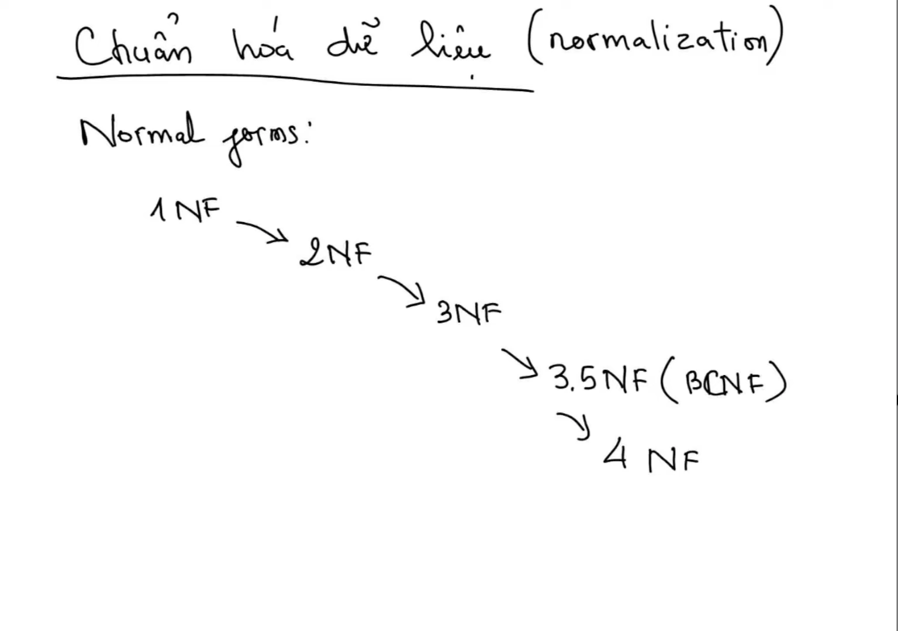

# Part 2: Chuẩn Hóa Cơ Sở Dữ Liệu - Database Normalization

## 1. Tổng quan về Chuẩn hóa Cơ sở Dữ liệu

### 1.1 Khái niệm Chuẩn hóa (Database Normalization)

**Chuẩn hóa cơ sở dữ liệu** (**Database Normalization**) là phương pháp thiết kế lược đồ quan hệ mang tính hệ thống (do Edgar F. Codd đề xuất vào năm 1970 cùng với mô hình CSDL quan hệ). Bản chất của chuẩn hóa là quá trình **phân rã logic** (**logical decomposition**) một bảng dữ liệu lớn hoặc chưa tối ưu thành nhiều bảng nhỏ hơn có cấu trúc chặt chẽ, được liên kết với nhau qua các ràng buộc quan hệ (**Foreign Keys**).

Mục đích cốt lõi của chuẩn hóa:
1. **Giảm thiểu tối đa sự dư thừa dữ liệu** (**Minimize Data Redundancy**).
2. **Ngăn chặn triệt để các bất thường dữ liệu** (**Prevent Data Anomalies** khi thực hiện Thêm/Sửa/Xóa).
3. **Bảo vệ tính toàn vẹn dữ liệu** (**Data Integrity**) ở cấp độ tầng lưu trữ (Storage Engine), thay vì phó mặc hoàn toàn cho tầng ứng dụng (Application Layer).

### 1.2 Thế nào là một Cơ sở dữ liệu được thiết kế tốt?


*Picture 1: Characteristics of a well-designed database — must satisfy four simultaneous criteria: Completeness (stores all required facts), No Unnecessary Redundancy (no repeated facts), No Anomalies on INSERT/UPDATE/DELETE, and Data Integrity enforced at the storage engine level, not delegated to application code.*

Một hệ thống cơ sở dữ liệu được coi là có thiết kế chất lượng cao khi thỏa mãn đồng thời các tiêu chí sau:

- **Chứa đầy đủ thông tin** (**Completeness**): Đây là điều kiện tiên quyết. Lược đồ phải lưu trữ trọn vẹn mọi dữ kiện nghiệp vụ mà người dùng và ứng dụng yêu cầu.
- **Không bị dư thừa dữ liệu** (**No Unnecessary Redundancy**): 
  - Không lưu trữ những dữ liệu vô ích không bao giờ dùng đến.
  - Không lặp lại cùng một giá trị dữ liệu tại nhiều vị trí khác nhau. Việc lưu trùng lặp không chỉ gây lãng phí dung lượng ổ đĩa (Disk Storage) và bộ nhớ đệm (Buffer Pool/RAM), mà quan trọng hơn là gây lãng phí chi phí I/O khi đọc/ghi và dễ dẫn đến sai lệch thông tin khi cập nhật.
- **Loại bỏ các bất thường khi thao tác dữ liệu** (**Eliminate Anomalies**): Tránh các lỗi logic khi thực hiện `INSERT`, `UPDATE`, hoặc `DELETE`.
- **Đảm bảo tính nhất quán và toàn vẹn** (**Data Consistency & Integrity**): Mọi quy tắc nghiệp vụ phải được bảo vệ bởi các ràng buộc (`PRIMARY KEY`, `FOREIGN KEY`, `UNIQUE`, `CHECK`, `NOT NULL`).

---

## 2. Các Dạng Bất Thường Dữ Liệu (Data Anomalies)

Khi một bảng cơ sở dữ liệu chưa được chuẩn hóa (thường gọi là **Bảng 0NF** hay **Unnormalized Table**), toàn bộ dữ liệu của nhiều thực thể khác nhau bị dồn ép vào cùng một cấu trúc phẳng. Điều này làm phát sinh 3 dạng bất thường nghiêm trọng:

### Minh họa Bảng chưa chuẩn hóa: `Unnormalized_Enrollments`

| student_name | course_name | course_start_date | teacher_name | teacher_phone |
| :--- | :--- | :--- | :--- | :--- |
| Nguyen Van A | Lập trình OOP | 2026-10-01 | Tran Van X | 0901234567 |
| Le Thi B | Lập trình OOP | 2026-10-01 | Tran Van X | 0901234567 |
| Tran Van C | Cơ sở dữ liệu RDBMS | 2026-10-15 | Nguyen Thi Y | 0987654321 |
| Nguyen Van A | Cơ sở dữ liệu RDBMS | 2026-10-15 | Nguyen Thi Y | 0987654321 |

```
┌────────────────────────────────────────────────────────────────────────────┐
│                    3 DẠNG BẤT THƯỜNG DỮ LIỆU (ANOMALIES)                   │
├──────────────────────────┬──────────────────────────┬──────────────────────┤
│      UPDATE ANOMALY      │      INSERT ANOMALY      │    DELETE ANOMALY    │
│  (Bất thường Cập nhật)   │    (Bất thường Chèn)     │  (Bất thường Xóa)    │
├──────────────────────────┼──────────────────────────┼──────────────────────┤
│ Sửa một sự thật ở nhiều  │ Không thể thêm thực thể  │ Xóa một thực thể vô  │
│ dòng; nếu sót 1 dòng sẽ  │ mới khi thiếu thông tin  │ tình làm biến mất dữ │
│ gây mâu thuẫn dữ liệu.   │ của thực thể đi kèm.     │ liệu của thực thể kia│
└──────────────────────────┴──────────────────────────┴──────────────────────┘
```

### 2.1 Bất thường Cập nhật (Update Anomaly)


*Picture 2: Update Anomaly — The same real-world fact (e.g., a course's start date) is stored in multiple rows. Updating only one copy while missing others leaves the database in an inconsistent state where no single source of truth exists.*

- **Nguyên nhân**: Cùng một thông tin thực tế khách quan (ví dụ: ngày khai giảng của khóa học, số điện thoại của giáo viên) bị lưu lặp đi lặp lại ở nhiều dòng dữ liệu khác nhau.
- **Hệ quả**: Khi thông tin đó thay đổi (ví dụ: khóa học `Lập trình OOP` đổi lịch khai giảng sang ngày `2026-10-10`), câu lệnh cập nhật bắt buộc phải quét và sửa trên **toàn bộ** các dòng có chứa khóa học đó.
  - Nếu hệ thống gặp sự cố mạng, timeout, hoặc lập trình viên thiếu cẩn trọng khiến chỉ có 1 dòng được cập nhật còn dòng kia giữ nguyên:
    - Dòng 1: `Nguyen Van A` học `Lập trình OOP` khai giảng ngày `2026-10-10`.
    - Dòng 2: `Le Thi B` học `Lập trình OOP` khai giảng ngày `2026-10-01`.
  - Lúc này dữ liệu rơi vào trạng thái **mất tính nhất quán** (**Inconsistent State**). Hệ thống không thể xác định đâu mới là ngày khai giảng chính xác.

### 2.2 Bất thường Chèn (Insert Anomaly)


*Picture 3: Insert Anomaly — Two independent entities (Courses and Students) are forced into a single table. A new course cannot be recorded until at least one student enrolls, because the student column is part of the primary key or has a NOT NULL constraint.*

- **Nguyên nhân**: Hai thực thể độc lập (`Courses` và `Students`) bị gộp chung vào một bảng, trong đó khóa chính đòi hỏi phải có sự tham gia của sinh viên.
- **Hệ quả**: Nhà trường muốn mở một khóa học mới mang tên `Lập trình Python Nâng cao` dự kiến mở vào tháng tới, nhưng hiện tại **chưa có sinh viên nào đăng ký**.
  - Nếu cột `student_name` nằm trong Khóa chính hoặc có ràng buộc `NOT NULL`, hệ thống **hoàn toàn không thể chèn bản ghi mới** cho khóa học này.
  - Muốn thêm khóa học, người quản trị buộc phải nhập một sinh viên "giả" (Dummy Student / Sentinel Value) như `student_name = 'N/A'` hoặc chờ đến khi có sinh viên thật đăng ký. Cả hai cách giải quyết đều phá vỡ tính đúng đắn của dữ liệu.

### 2.3 Bất thường Xóa (Delete Anomaly)


*Picture 4: Delete Anomaly — Deleting the last enrollment row for a course silently destroys the teacher's contact information stored on the same physical row, even though the teacher still exists in the institution.*

- **Nguyên nhân**: Dữ liệu của thực thể yếu và thực thể mạnh bị ràng buộc cứng ngắc trên cùng một dòng vật lý.
- **Hệ quả**: 
  - Giả sử khóa học `Cơ sở dữ liệu RDBMS` chỉ có 2 sinh viên tham gia (`Tran Van C` và `Nguyen Van A`). Nếu cả hai sinh viên này lần lượt hủy môn học, ta tiến hành xóa 2 bản ghi này khỏi bảng.
  - Việc xóa 2 dòng sinh viên này sẽ đồng thời **xóa sổ vĩnh viễn** thông tin về giáo viên `Nguyen Thi Y` cùng số điện thoại `0987654321` ra khỏi hệ thống trường học, mặc dù giáo viên này vẫn đang công tác tại trường.
  - Xóa một sự kiện tham gia (Enrollment) lại vô tình làm mất thông tin danh mục thực thể (Teacher Profile).

---

## 3. Lý thuyết Phụ thuộc hàm (Functional Dependency)

Để hiểu chính xác các dạng chuẩn hóa, trước hết ta cần nắm vững công cụ toán học nền tảng: **Phụ thuộc hàm** (**Functional Dependency - FD**).

### 3.1 Định nghĩa Phụ thuộc hàm


*Picture 5: Principle 1 (1NF) — Each column must hold exactly one atomic, indivisible value. Storing comma-separated lists, arrays, or repeating groups inside a single cell violates atomicity and makes filtering, indexing, and joining impossible.*

Cho một lược đồ quan hệ $R$, giả sử $X$ và $Y$ là hai tập con các thuộc tính của $R$.

> Ta nói **$Y$ phụ thuộc hàm vào $X$** (ký hiệu: **$X \rightarrow Y$**, đọc là "$X$ xác định $Y$") nếu và chỉ nếu: với bất kỳ hai bộ dữ liệu (dòng) $t_1$ và $t_2$ trong $R$, hễ giá trị của $X$ trên hai dòng đó bằng nhau thì giá trị của $Y$ trên hai dòng đó cũng bắt buộc phải bằng nhau:
> 
> $$t_1[X] = t_2[X] \implies t_1[Y] = t_2[Y]$$

- $X$ được gọi là **Định thức** (**Determinant**).
- $Y$ được gọi là **Thuộc tính phụ thuộc** (**Dependent Attribute**).

_Ví dụ:_ 
- `citizen_id -> full_name, birth_date` (Biết số CCCD chắc chắn xác định duy nhất được họ tên và ngày sinh).
- `course_id -> course_name, credits` (Biết mã môn học chắc chắn xác định được tên môn và số tín chỉ).

### 3.2 Phụ thuộc hàm đầy đủ vs Phụ thuộc một phần


*Picture 6: Principle 2 (2NF) — Every non-key attribute must functionally depend on the entire composite primary key, not just a subset of it. A Partial Dependency means the attribute really belongs to a separate entity and should be extracted into its own table.*

- **Phụ thuộc hàm đầy đủ** (**Full Functional Dependency**): Thuộc tính $Y$ phụ thuộc hàm vào tập thuộc tính $X$, và **không phụ thuộc vào bất kỳ tập con thực sự nào của $X$**.
  - Ký hiệu: $X \xrightarrow{\text{full}} Y$.
  - Nếu $X = \{A, B\}$, $Y$ phải cần cả $A$ và $B$ mới xác định được; chỉ biết riêng $A$ hoặc riêng $B$ thì không đủ để xác định $Y$.
  - _Ví dụ:_ `{student_id, course_id} -> final_grade` (Điểm tổng kết môn học bắt buộc phải cần cả mã sinh viên và mã môn học).
- **Phụ thuộc một phần** (**Partial Dependency**): Thuộc tính $Y$ phụ thuộc vào một phần (tập con) của một khóa phức hợp.
  - _Ví dụ:_ Trong bảng có khóa chính là `{student_id, course_id}`, nhưng cột `student_name` chỉ phụ thuộc vào một mình `student_id`.

### 3.3 Phụ thuộc bắc cầu (Transitive Dependency)


*Picture 7: Principle 3 (3NF) — No non-key attribute may depend on another non-key attribute (transitive chain: PK → A → B). Column B should be derived from or stored in a separate table where A is the primary key.*


*Picture 8: Principle 3.5 (BCNF — Boyce-Codd Normal Form) — A stricter version of 3NF: every determinant (left-hand side of any functional dependency) must be a Super Key of the table. BCNF eliminates anomalies missed by 3NF when overlapping candidate keys exist.*

- Cho 3 tập thuộc tính $X, Y, Z$. Nếu tồn tại:
  1. $X \rightarrow Y$
  2. $Y \rightarrow Z$ ($Y$ không suy ngược lại được $X$)
  3. $Z$ không thuộc $X$ hay $Y$
- Khi đó, ta nói **$Z$ phụ thuộc bắc cầu vào $X$ thông qua $Y$** ($X \rightarrow Y \rightarrow Z$).
- _Ví dụ:_ `student_id -> major_id -> dean_name` (Mã sinh viên xác định mã khoa; mã khoa xác định tên trưởng khoa. Dẫn đến sinh viên gián tiếp xác định tên trưởng khoa).

#### Ví dụ minh họa: Bảng `StudentGrades` (vi phạm — tồn tại phụ thuộc bắc cầu)

Xét bảng điểm học sinh với khóa chính là `student_id`:

| student_id (PK) | avg_score | academic_rank |
| :--- | :--- | :--- |
| A | 7 | Trung bình |
| B | 8 | Giỏi |
| C | 6 | Trung bình |

Quy tắc xếp loại: `1–4: Yếu` · `5–7: Trung bình` · `8–10: Giỏi`

**Phân tích chuỗi phụ thuộc hàm:**

$$\text{StudentID} \xrightarrow{(1)} \text{AvgScore} \xrightarrow{(2)} \text{AcademicRank}$$

- **(1)** `student_id → avg_score`: Mỗi học sinh có đúng 1 điểm trung bình — phụ thuộc **trực tiếp** vào PK. ✅
- **(2)** `avg_score → academic_rank`: Xếp loại được suy ra hoàn toàn từ điểm số theo quy tắc range — phụ thuộc **vào `avg_score`**, không phụ thuộc trực tiếp vào `student_id`. ❌
- `avg_score` **không phải là Khóa chính**, nhưng lại "làm trung gian" xác định `academic_rank` → đây chính là **phụ thuộc bắc cầu**.

**Hệ quả (Update Anomaly):** Nếu học sinh A được phúc khảo nâng điểm từ `7` lên `8`, cột `avg_score` được sửa nhưng cột `academic_rank` vẫn còn giá trị `Trung bình` cũ — dữ liệu mâu thuẫn ngay trong cùng 1 dòng.


*Picture 9: Example of Transitive Dependency — In the StudentGrades table, student_id → avg_score → academic_rank forms a two-step chain. When a score is updated, the rank column silently becomes stale, creating a data contradiction within the same row.*

**Giải pháp:** Tách `academic_rank` ra khỏi bảng `StudentGrades`. Có 2 hướng tùy theo nghiệp vụ:
- **Hướng 1 — Bảng tra cứu (Lookup Table):** Tạo bảng `GradeRanks(min_score, max_score, rank)` lưu quy tắc xếp loại độc lập; `StudentGrades` chỉ giữ `student_id` và `avg_score`, tra cứu xếp loại qua `JOIN`.
- **Hướng 2 — Tính toán động:** Xóa hoàn toàn cột `academic_rank`, tính trực tiếp bằng `CASE WHEN avg_score >= 8 THEN 'Giỏi' ...` trong câu truy vấn.

Cả 2 hướng đều loại bỏ hoàn toàn chuỗi bắc cầu.


*Picture 10: Removing the Transitive Dependency — Two valid solutions: (1) Extract a GradeRanks lookup table keyed on score ranges, and JOIN at query time; or (2) Drop academic_rank entirely and compute it on-the-fly with CASE WHEN avg_score >= 8 THEN 'Giỏi' .... Both approaches eliminate the stale-data risk at its source.*

> [!NOTE]
> Ví dụ về SQL tái cấu trúc cụ thể cho trường hợp phụ thuộc bắc cầu được trình bày chi tiết tại **§4.3 Dạng chuẩn 3 (3NF)** — bao gồm cả trường hợp giáo viên phụ trách và thuộc tính suy diễn (`academic_rank`).

---

## 4. Các Dạng Chuẩn Hóa (Normal Forms Progression)



*Picture 11: The cumulative normalization hierarchy — each level fully inherits all constraints of the level below it. In practice, most OLTP systems stop at 3NF for an optimal balance between data integrity and query simplicity. Advancing to BCNF or 4NF is warranted only when overlapping candidate keys or independent multi-valued facts are detected.*

Quá trình chuẩn hóa mang tính **lũy tiến** (**Cumulative Hierarchy**): Để đạt được cấp độ chuẩn $N$, lược đồ trước hết bắt buộc phải thỏa mãn tất cả các điều kiện của cấp độ chuẩn $(N-1)$.

```
   ┌────────────────────────────────────────────────────────┐
   │ 5NF (Loại bỏ Phụ thuộc Nối - Join Dependency)          │
   │  ┌──────────────────────────────────────────────────┐  │
   │  │ 4NF (Loại bỏ Phụ thuộc Đa trị - Multi-valued)     │  │
   │  │  ┌────────────────────────────────────────────┐  │  │
   │  │  │ BCNF / 3.5NF (Mọi định thức là Super Key)  │  │  │
   │  │  │  ┌──────────────────────────────────────┐  │  │  │
   │  │  │  │ 3NF (Không có Phụ thuộc Bắc cầu)     │  │  │  │
   │  │  │  │  ┌────────────────────────────────┐  │  │  │  │
   │  │  │  │  │ 2NF (Phụ thuộc Hàm Đầy đủ)     │  │  │  │  │
   │  │  │  │  │  ┌──────────────────────────┐  │  │  │  │  │
   │  │  │  │  │  │ 1NF (Tính Nguyên tử)      │  │  │  │  │  │
   │  │  │  │  │  │   (Atomic Values Only)   │  │  │  │  │  │
   │  │  │  │  │  └──────────────────────────┘  │  │  │  │  │
   │  │  │  │  └────────────────────────────────┘  │  │  │  │
   │  │  │  └──────────────────────────────────────┘  │  │  │
   │  │  └────────────────────────────────────────────┘  │  │
   │  └──────────────────────────────────────────────────┘  │
   └────────────────────────────────────────────────────────┘
```

---

### 4.1 Dạng chuẩn 1 (First Normal Form - 1NF): Tính Nguyên Tử (Atomicity)

#### Điều kiện đạt 1NF:
1. Mỗi ô giao giữa một hàng và một cột chỉ được phép chứa **đúng một giá trị nguyên tố duy nhất** (**Atomic Value**).
2. Không chứa danh sách mảng (Arrays), chuỗi phân tách bởi dấu phẩy (Comma-Separated Values - CSV), hoặc khối dữ liệu phức hợp (XML/JSON) nếu các thuộc tính con bên trong cần tham gia vào logic tìm kiếm, lọc, nối hoặc phân tích.
3. Không có các nhóm cột lặp lại mang cùng ý nghĩa (Repeating groups, ví dụ: `phone1, phone2, phone3`).

#### Ví dụ vi phạm 1NF:

Bảng `Courses` có một cột chứa danh sách nhiều giáo viên:

| course_id | course_name | teachers |
| :--- | :--- | :--- |
| C01 | Lập trình Web | Nguyen Van A, Tran Van B |
| C02 | Hệ điều hành | Le Thi C |

#### Tại sao thiết kế vi phạm 1NF làm sụp đổ hiệu năng?
- **Không thể tận dụng chỉ mục B-Tree (Index Invalidation)**: Khi cần tìm xem giáo viên `Tran Van B` dạy những môn nào, câu lệnh bắt buộc phải dùng `WHERE teachers LIKE '%Tran Van B%'`. Truy vấn này dẫn đến **Quét tuần tự toàn bộ bảng** (**Full Table Scan / Sequential Scan**), chi phí I/O cực kỳ đắt đỏ trên bảng lớn.
- **Thao tác Cập nhật phức tạp**: Muốn xóa giáo viên `Nguyen Van A` khỏi môn `C01`, ứng dụng phải tải toàn bộ chuỗi ký tự lên bộ nhớ, cắt chuỗi, ghép chuỗi và cập nhật lại toàn bộ ô.
- **Không hỗ trợ sắp xếp và toàn vẹn tham chiếu**: Không thể áp dụng khóa ngoại `FOREIGN KEY` lên từng phần tử bên trong chuỗi CSV; không thể dùng lệnh `ORDER BY` theo từng giáo viên.

> [!NOTE]
> **Khi nào lưu trữ JSON trong CSDL quan hệ là hợp lệ?**
> - Các RDBMS hiện đại (SQL Server hỗ trợ `ISJSON`, `JSON_VALUE`, PostgreSQL hỗ trợ kiểu bản địa `JSONB`) cho phép lưu trữ cấu trúc JSON.
> - **Nguyên tắc vàng**: Chỉ lưu JSON khi dữ liệu đó là cấu trúc động không cố định (Dynamic Schema, User Configs, Audit Payload) và ứng dụng chỉ đọc/ghi cả khối như một giá trị nguyên bản, **không** dùng các trường con trong JSON làm khóa chính, khóa ngoại hoặc điều kiện `JOIN` thường xuyên.

#### 🔬 Góc nhìn Thực chiến: 1NF và ngoại lệ trong hệ thống sản xuất

Sách giáo khoa nói **1NF cấm lưu mảng, cấm lưu JSON, cấm lưu CSV** — nhưng tại sao các dự án lớn vẫn dùng `JSONB`, `text[]`, hoặc cột `settings VARCHAR`? Câu trả lời nằm ở sự phân biệt giữa **lỗi thiết kế** và **đánh đổi kiến trúc có chủ đích**.

##### Phân loại 3 dạng "lưu danh sách" trong thực tế

**Dạng 1 — Chuỗi CSV trong cột VARCHAR:** `tags = 'php,java,sql'`
> ⚠️ Đây là **Anti-Pattern** trong 95% trường hợp.
- `WHERE tags LIKE '%sql%'` → **Full Table Scan** toàn bộ bảng, vô hiệu hóa B-tree Index.
- Match nhầm: `'%sql%'` sẽ khớp cả `nosql`, `mysql`.
- Không có Foreign Key để kiểm soát giá trị hợp lệ.

**Dạng 2 — Cột mảng gốc của RDBMS:** `tags text[]`, `phone_numbers varchar(15)[]`
> ⚠️ **Dùng được có điều kiện** — PostgreSQL có toán tử `ANY`, `@>` và GIN Index hỗ trợ tìm kiếm nhanh, nhưng **không hỗ trợ Foreign Key trên từng phần tử**. Nếu phần tử cần tham chiếu sang bảng khác → dùng bảng junction thay thế.

**Dạng 3 — Cột `JSON` / `JSONB`**
> ✅ **Hợp lệ khi đáp ứng điều kiện** (xem bên dưới).

Theo định nghĩa gốc của E.F. Codd, 1NF yêu cầu giá trị phải "nguyên tố đối với RDBMS" (Atomic to the DBMS):
- Nếu ứng dụng chỉ xem khối JSON là một **"Hộp đen"** — RDBMS lưu và trả nguyên cục, không `JOIN`, không `WHERE` vào thuộc tính con → khối JSON là một **giá trị nguyên tố**. **Không vi phạm tinh thần 1NF.**
- Nếu bạn viết `WHERE JSON_EXTRACT(data, '$.user_id') = ...` hoặc JOIN qua JSON → đang phá vỡ 1NF và biến RDBMS thành Document Database nửa vời.

##### Khi nào ĐƯỢC PHÉP dùng JSON / Mảng?

| Case | Ví dụ thực tế | Lý do hợp lệ |
| :--- | :--- | :--- |
| **Thuộc tính động (Polymorphic)** | E-commerce: Áo thun có `size/color`, Laptop có `cpu/ram/battery` | Schema thay đổi theo từng loại sản phẩm, chuẩn hóa EAV 4 bảng làm tê liệt Query Optimizer |
| **Đóng băng lịch sử (Snapshot)** | Hóa đơn: địa chỉ giao hàng tại thời điểm thanh toán | Khách đổi địa chỉ sau này không được làm thay đổi hóa đơn cũ |
| **Cấu hình / Metadata người dùng** | `{"theme": "dark", "language": "vi", "sidebar": true}` | Client đọc/ghi nguyên khối, RDBMS không bao giờ `GROUP BY` thuộc tính con |

> **Trường hợp Snapshot:** Nếu chỉ lưu `address_id FK → Addresses`, khi khách dọn nhà và sửa địa chỉ, toàn bộ hóa đơn 3 năm trước bị **sai lệch địa chỉ**. Lưu `checkout_snapshot JSONB` đảm bảo **Immutability** (tính bất biến) của hồ sơ lịch sử.

##### Bảng đánh đổi (Trade-off Matrix)

| Tiêu chí | Chuẩn hóa 1NF (Tách bảng) | Phi chuẩn (JSON / Array) |
| :--- | :--- | :--- |
| **Toàn vẹn tham chiếu (FK)** | ✅ Tuyệt đối | ❌ Không có FK |
| **Cập nhật đồng thời (Concurrency)** | ✅ Chỉ lock dòng con | ❌ Ghi đè toàn cột JSON |
| **Tìm kiếm (Search)** | ✅ B-tree Index, cực nhẹ | ⚠️ Cần GIN Index nặng hơn nhiều lần |
| **Phân tích / Thống kê** | ✅ `COUNT()`, `GROUP BY` tự nhiên | ❌ Phải bung mảng (`jsonb_array_elements`, `UNNEST`) |
| **Linh hoạt schema** | ❌ Cần `ALTER TABLE` | ✅ Thêm field mà không migrate |

##### Khung quyết định khi thiết kế

```
Dữ liệu có cần FK trỏ sang bảng khác?
     │
     ├── CÓ  → [ BẢNG RIÊNG - chuẩn 1NF ]
     │
     └── KHÔNG
           │
           Phần tử có tham gia WHERE / JOIN / GROUP BY?
                │
                ├── CÓ  → [ BẢNG RIÊNG - chuẩn 1NF ]
                │
                └── KHÔNG
                      │
                      Schema có thay đổi theo từng loại (polymorphic)?
                            │
                            ├── CÓ  → [ CỘT JSONB ] (e.g. product attributes)
                            │
                            └── KHÔNG → [ BẢNG RIÊNG - chuẩn 1NF ]
```

##### Ví dụ thực chiến: Bài toán "Đóng băng lịch sử" (Snapshot)

Trong nghiệp vụ thương mại điện tử và tài chính, bài toán **"Đóng băng lịch sử" (Historical Snapshot)** là minh chứng kinh điển nhất cho việc **sử dụng JSON có chủ đích** thay vì cố ép chuẩn hóa bằng Foreign Key (Khóa ngoại).

**1. Hiểm họa của thiết kế ngây thơ (Naive Foreign Key)**

Nếu thiết kế theo chuẩn hóa thuần túy:

```text
[Customers] 1 ──< [Customer_Addresses] (address_id, street, city)
                          │
                          │ (FK: shipping_address_id)
                          ▼
                       [Orders]
```

- **Tháng 01/2023**: Khách A đặt đơn hàng `#ORD-101` giao về địa chỉ `address_id = 5` ("Hà Nội").
- **Tháng 06/2024**: Khách A sửa lại `address_id = 5` thành "TP.HCM" trong sổ địa chỉ.
- **Hậu quả**: Khi kế toán đối soát đơn hàng `#ORD-101` của năm 2023, địa chỉ giao hàng tự động biến thành TP.HCM.
- **Nguyên tắc**: Đơn hàng & Hóa đơn là **chứng từ pháp lý bất biến**. Toàn bộ bối cảnh (địa chỉ, giá tiền, chiết khấu) phải được đóng băng vĩnh viễn lúc thanh toán.

**2. Thiết kế Table thực tế (SQL Server / PostgreSQL)**

- **Bảng `Customer_Addresses`**: Sổ địa chỉ (Address Book) để khách hàng quản lý và chọn.
- **Bảng `Orders`**: Lưu một cột `shipping_snapshot` dạng **JSON/JSONB** chứa toàn bộ dữ liệu địa chỉ tại lúc checkout.

```sql
-- 1. Bảng Đơn hàng (Áp dụng Snapshot JSON để đảm bảo tính bất biến)
CREATE TABLE dbo.Orders (
    order_id             BIGINT IDENTITY(1,1) CONSTRAINT PK_Orders PRIMARY KEY,
    order_code           VARCHAR(32) NOT NULL CONSTRAINT UQ_Orders_code UNIQUE,
    customer_id          INT NOT NULL,
    total_amount         DECIMAL(18, 2) NOT NULL,
    
    -- [CRITICAL]: Cột Snapshot đóng băng toàn bộ thông tin nhận hàng lúc bấm mua
    shipping_snapshot    NVARCHAR(MAX) NOT NULL,
    
    -- Ràng buộc kiểm tra tính hợp lệ của định dạng JSON trong SQL Server
    CONSTRAINT CK_Orders_shipping_snapshot_isjson CHECK (ISJSON(shipping_snapshot) = 1),
    
    created_at           DATETIME2(7) NOT NULL CONSTRAINT DF_Orders_created_at DEFAULT SYSDATETIME()
);
```

> **Ghi chú**: Trên PostgreSQL, ta sẽ dùng kiểu `shipping_snapshot JSONB NOT NULL` (không cần check `ISJSON` vì kiểu bản địa tự động kiểm tra).

**3. Cấu trúc dữ liệu bên trong `shipping_snapshot`**

Khi Backend xử lý request đặt hàng, nó lấy thông tin địa chỉ từ sổ địa chỉ, đóng gói thành JSON và insert nguyên khối:

```json
{
  "address_book_id": 5,
  "recipient_name": "Nguyễn Văn A",
  "phone_number": "0912345678",
  "street_address": "Số 12 Chùa Bộc",
  "ward": "Phường Quang Trung",
  "district": "Quận Đống Đa",
  "city": "Hà Nội",
  "snapshotted_at": "2024-03-15T09:30:00Z"
}
```

**4. Khai thác dữ liệu**

Khách hàng sau đó có quyền sửa hoặc xóa địa chỉ ở bảng `Customer_Addresses`, nhưng đơn hàng cũ hoàn toàn **miễn nhiễm**. Khi in hóa đơn, ứng dụng chỉ cần lấy khối JSON ra để render. Hoặc trên SQL Server, có thể trích xuất nếu cần:

```sql
SELECT 
    order_code,
    JSON_VALUE(shipping_snapshot, '$.recipient_name') AS recipient_name,
    JSON_VALUE(shipping_snapshot, '$.city')           AS city
FROM dbo.Orders
WHERE order_code = 'ORD-20240315-001';
```

**Tại sao thiết kế này hợp pháp với tinh thần 1NF?**

1. **Tính nguyên tố**: RDBMS xem cột `shipping_snapshot` là một khối văn bản tĩnh (Immutable Blob). Hệ thống không chạy câu lệnh `JOIN` hay `WHERE shipping_snapshot.city = ...` trong các luồng nghiệp vụ cốt lõi. Khối JSON được trả nguyên vẹn về cho Application xử lý.
2. **Không Concurrency Lock**: Không cần tạo thêm bảng trung gian `Order_Shipping_Addresses` dài dòng và không bị lock lây lan.
3. **Mở rộng dễ dàng**: Khi đơn vị vận chuyển đòi thêm trường (như toạ độ `latitude`, `longitude`), bạn không cần `ALTER TABLE` bảng `Orders` (vốn có thể chứa hàng chục triệu dòng).


#### Tái cấu trúc chuẩn 1NF:

Tách mối quan hệ giữa Khóa học và Giáo viên thành một bảng liên kết độc lập:

```sql
-- ============================================================
-- VÍ DỤ ĐỘC LẬP §4.1: Hệ thống khóa học - nhiều giáo viên (N:N)
-- Business rule: 1 khóa học có thể có nhiều giáo viên dạy
-- ============================================================

-- Bảng danh mục Khóa học
CREATE TABLE dbo.Courses (
    course_id   VARCHAR(10)   NOT NULL,
    course_name NVARCHAR(100) NOT NULL,
    CONSTRAINT PK_Courses PRIMARY KEY (course_id)
);

-- Bảng danh mục Giáo viên
CREATE TABLE dbo.Teachers (
    teacher_id   INT           IDENTITY(1,1) NOT NULL,
    teacher_name NVARCHAR(100) NOT NULL,
    CONSTRAINT PK_Teachers PRIMARY KEY (teacher_id)
);

-- Bảng liên kết đảm bảo tính nguyên tử (1NF)
CREATE TABLE dbo.CourseTeachers (
    course_id  VARCHAR(10) NOT NULL,
    teacher_id INT         NOT NULL,
    CONSTRAINT PK_CourseTeachers PRIMARY KEY (course_id, teacher_id),
    CONSTRAINT FK_CourseTeachers_Courses FOREIGN KEY (course_id) REFERENCES dbo.Courses (course_id),
    CONSTRAINT FK_CourseTeachers_Teachers FOREIGN KEY (teacher_id) REFERENCES dbo.Teachers (teacher_id)
    -- PATTERN: Bảng junction N:N luôn có 2 FK trỏ về 2 bảng cha.
    -- WHY index on teacher_id: SQL Server không tự tạo index trên FK cột thứ 2.
    --   Thêm: CREATE INDEX IX_CourseTeachers_TeacherId ON dbo.CourseTeachers (teacher_id);
);
```

---

### 4.2 Dạng chuẩn 2 (Second Normal Form - 2NF): Phụ thuộc hàm Đầy đủ (Full Functional Dependency)

#### Điều kiện đạt 2NF:
1. Bảng đã đạt **1NF**.
2. Mọi thuộc tính không khóa (**Non-prime attribute**) phải **phụ thuộc hàm đầy đủ** vào toàn bộ Khóa chính.
3. **Loại bỏ hoàn toàn phụ thuộc một phần** (**No Partial Functional Dependency**).

> [!IMPORTANT]
> **Ghi nhớ**: Bất kỳ bảng nào đã đạt 1NF mà Khóa chính chỉ bao gồm **một cột duy nhất** (Single-column Primary Key) thì bảng đó **nghiễm nhiên đạt 2NF**. Vi phạm 2NF chỉ có thể xảy ra khi bảng có **Khóa chính phức hợp** (**Composite Primary Key**).

#### Ví dụ vi phạm 2NF:

Bảng `Enrollments` có khóa chính phức hợp là `{course_id, student_id}`:

| course_id (PK) | student_id (PK) | course_name | student_name | register_date |
| :--- | :--- | :--- | :--- | :--- |
| C01 | S101 | Lập trình OOP | Nguyen Van A | 2026-09-01 |
| C01 | S102 | Lập trình OOP | Tran Van B | 2026-09-02 |
| C02 | S101 | CSDL Quan hệ | Nguyen Van A | 2026-09-03 |

- **Phân tích phụ thuộc hàm**:
  - `{course_id, student_id} -> register_date`: Phụ thuộc đầy đủ. Cần cả mã sinh viên và mã khóa học mới biết ngày đăng ký cụ thể.
  - `course_id -> course_name`: Phụ thuộc một phần. Chỉ cần biết `course_id` là biết `course_name`, hoàn toàn không liên quan đến `student_id`.
  - `student_id -> student_name`: Phụ thuộc một phần. Chỉ cần biết `student_id` là biết `student_name`.

#### Tái cấu trúc chuẩn 2NF:

Đưa các thuộc tính bị phụ thuộc một phần ra các bảng riêng có khóa chính tương ứng:

```
[Bảng 2NF 1: Courses]
  ├── course_id (PK)
  └── course_name

[Bảng 2NF 2: Students]
  ├── student_id (PK)
  └── student_name

[Bảng 2NF 3: Enrollments]
  ├── course_id (PK, FK)
  ├── student_id (PK, FK)
  └── register_date (Phụ thuộc đầy đủ vào cả 2 khóa)
```

---

### 4.3 Dạng chuẩn 3 (Third Normal Form - 3NF): Không Phụ thuộc Bắc cầu (No Transitive Dependency)

#### Điều kiện đạt 3NF:
1. Bảng đã đạt **2NF**.
2. **Không có bất kỳ thuộc tính không khóa nào phụ thuộc bắc cầu vào Khóa chính**.
3. Phát biểu trực quan: *"Mỗi thuộc tính không khóa phải phụ thuộc trực tiếp vào Khóa chính, toàn bộ Khóa chính, và không có gì ngoài Khóa chính"* (Kent, 1983).

#### Ví dụ 1 vi phạm 3NF: Giáo viên phụ trách khóa học

Bảng `Courses` có khóa chính là `course_id`:

| course_id (PK) | course_name | teacher_id | teacher_name | teacher_phone |
| :--- | :--- | :--- | :--- | :--- |
| C01 | Lập trình C++ | T10 | Nguyen Van An | 0901112233 |
| C02 | Cấu trúc dữ liệu | T10 | Nguyen Van An | 0901112233 |
| C03 | Mạng máy tính | T20 | Le Thi Binh | 0988889999 |

- **Phân tích phụ thuộc hàm**:
  - `course_id -> teacher_id`: Mỗi khóa học do 1 giáo viên phụ trách.
  - `teacher_id -> teacher_name, teacher_phone`: Biết mã giáo viên sẽ biết tên và số điện thoại của giáo viên đó.
  - Ta có chuỗi bắc cầu: `course_id` $\rightarrow$ `teacher_id` $\rightarrow$ `{teacher_name, teacher_phone}`.
  - Trong đó `teacher_id` **không phải là khóa chính hay super key** của bảng `Courses`. Dẫn đến tên và số điện thoại của giáo viên `Nguyen Van An` bị lặp lại ở mọi môn do thầy phụ trách.

**Giải pháp tái cấu trúc 3NF cho Ví dụ 1:**

```sql
-- 1. Bảng Teachers: Lưu danh mục giáo viên
CREATE TABLE dbo.Teachers (
    teacher_id    INT           IDENTITY(1,1) NOT NULL,
    teacher_name  NVARCHAR(100) NOT NULL,
    teacher_phone VARCHAR(15)   NOT NULL,
    CONSTRAINT PK_Teachers PRIMARY KEY (teacher_id)
);

-- 2. Bảng Courses: Chỉ giữ khóa ngoại teacher_id trỏ về Teachers
--    Tên và số điện thoại giáo viên đã được tách ra bảng riêng (không còn phụ thuộc bắc cầu)
CREATE TABLE dbo.Courses (
    course_id   VARCHAR(10)   NOT NULL,
    course_name NVARCHAR(100) NOT NULL,
    teacher_id  INT           NOT NULL,
    CONSTRAINT PK_Courses PRIMARY KEY (course_id),
    CONSTRAINT FK_Courses_Teachers FOREIGN KEY (teacher_id) 
        REFERENCES dbo.Teachers (teacher_id)
);
```

#### Ví dụ 2 vi phạm 3NF: Thuộc tính suy diễn (Derived Attribute)

Bảng `StudentExams` có khóa chính là `student_id`:

| student_id (PK) | full_name | gpa | academic_rank |
| :--- | :--- | :--- | :--- |
| S01 | Nguyen Van A | 8.5 | Gioi |
| S02 | Le Thi B | 6.2 | Trung binh |
| S03 | Tran Van C | 4.0 | Yeu |

- Quy tắc: Điểm từ `8.0 - 10.0` là `Gioi`, `5.0 - 7.9` là `Trung binh`, dưới `5.0` là `Yeu`.
- Ta có chuỗi: `student_id` $\rightarrow$ `gpa` $\rightarrow$ `academic_rank`.
- Thuộc tính `academic_rank` phụ thuộc trực tiếp vào `gpa`, nhưng `gpa` không phải là khóa chính.
  - Nếu sinh viên `S01` được phúc khảo nâng điểm từ `8.5` lên `9.0`, hệ thống chỉ sửa cột `gpa`. Nếu quên cập nhật cột `academic_rank`, dữ liệu sẽ bất nhất.
  - **Giải pháp**: Xóa bỏ cột `academic_rank` khỏi bảng.

**Giải pháp tái cấu trúc 3NF cho Ví dụ 2:**

Sử dụng Cột tính toán ảo (`COMPUTED COLUMN`) trong SQL Server. Dữ liệu sẽ được tính toán động mỗi khi `SELECT` dựa trên `gpa`, không lưu trữ vật lý nên không bao giờ xảy ra bất nhất dữ liệu:

```sql
CREATE TABLE dbo.StudentExams (
    student_id    VARCHAR(10)   NOT NULL,
    full_name     NVARCHAR(100) NOT NULL,
    gpa           DECIMAL(3,1)  NOT NULL,
    
    -- Thuộc tính suy diễn được tính toán tự động
    academic_rank AS (
        CASE 
            WHEN gpa >= 8.0 THEN 'Gioi'
            WHEN gpa >= 5.0 AND gpa < 8.0 THEN 'Trung binh'
            ELSE 'Yeu'
        END
    ),
    
    CONSTRAINT PK_StudentExams PRIMARY KEY (student_id)
);
```

---

### 4.4 Dạng chuẩn Boyce-Codd (BCNF / 3.5NF): Siêu khóa cho mọi Định thức

#### Tại sao cần BCNF?
Dạng chuẩn 3NF vẫn có kẽ hở: 3NF cho phép tồn tại phụ thuộc hàm $X \rightarrow Y$ mà $X$ không phải là Super Key, miễn là **$Y$ là một thuộc tính khóa** (**Prime Attribute** - thuộc tính nằm trong một Candidate Key nào đó). BCNF ra đời để bịt kín lỗ hổng này.

#### Điều kiện đạt BCNF:
- Lược đồ đã đạt **3NF**.
- Với **mọi** phụ thuộc hàm không tầm thường $X \rightarrow Y$ trong bảng, thì **$X$ bắt buộc phải là một Khóa siêu cấp** (**Super Key**).

#### Ví dụ vi phạm BCNF: Bảng Gia sư (`Tutoring_Assignments`)

Xét một nghiệp vụ với các quy tắc sau:
1. Mỗi sinh viên (`student_id`) có thể đăng ký nhiều môn học (`subject`).
2. Mỗi giáo viên (`teacher_id`) chỉ phụ trách giảng dạy **duy nhất 1 môn học**.
3. Với một môn học cụ thể, một sinh viên chỉ được kèm bởi **đúng 1 giáo viên**.

Bảng dữ liệu:

| student_id | subject | teacher_id |
| :--- | :--- | :--- |
| S01 | Toan | T_Thang |
| S02 | Toan | T_Thang |
| S01 | Ly | T_Huy |
| S02 | Ly | T_Nam |

- **Xác định các Candidate Key**:
  - Do `student_id` và `subject` xác định duy nhất 1 giáo viên $\rightarrow$ `{student_id, subject}` là một Khóa ứng viên.
  - Do mỗi giáo viên chỉ dạy 1 môn (`teacher_id -> subject`), nên khi biết `student_id` và `teacher_id`, ta cũng suy ra được `subject` $\rightarrow$ `{student_id, teacher_id}` cũng là một Khóa ứng viên.
- **Tập thuộc tính khóa**: Cả 3 cột `{student_id, subject, teacher_id}` đều là thuộc tính khóa.
- **Kiểm tra 3NF**: 
  - Phụ thuộc hàm `teacher_id -> subject` có thuộc tính bên phải là `subject` (nằm trong khóa), nên theo lý thuyết nó **đạt 3NF**.
- **Kiểm tra BCNF**:
  - Xét phụ thuộc `teacher_id -> subject`: `teacher_id` **không phải là Super Key** (bởi vì một mình `teacher_id` không thể định danh duy nhất được một dòng trong bảng này, ví dụ thầy `T_Thang` dạy cho cả `S01` và `S02`).
  - Do đó, bảng này **vi phạm BCNF**.

#### Tái cấu trúc chuẩn BCNF:

Tách thành 2 bảng để biến `teacher_id` thành Khóa chính thực sự:

```sql
-- Bảng tham chiếu: Danh mục sinh viên (giả định đã tồn tại)
CREATE TABLE dbo.Students (
    student_id INT           IDENTITY(1,1) NOT NULL,
    full_name  NVARCHAR(100) NOT NULL,
    CONSTRAINT PK_Students PRIMARY KEY (student_id)
);

-- Bảng 1: Phân công chuyên môn giáo viên
-- teacher_id là PK → teacher_id là Super Key → đạt BCNF
CREATE TABLE dbo.TeacherSubjects (
    teacher_id INT          NOT NULL,
    subject    NVARCHAR(50) NOT NULL,
    CONSTRAINT PK_TeacherSubjects PRIMARY KEY (teacher_id)
);

-- Bảng 2: Ghi nhận sinh viên học với giáo viên nào
CREATE TABLE dbo.StudentTutors (
    student_id INT NOT NULL,
    teacher_id INT NOT NULL,
    CONSTRAINT PK_StudentTutors PRIMARY KEY (student_id, teacher_id),
    CONSTRAINT FK_StudentTutors_Students FOREIGN KEY (student_id)
        REFERENCES dbo.Students (student_id),
    CONSTRAINT FK_StudentTutors_Teachers FOREIGN KEY (teacher_id)
        REFERENCES dbo.TeacherSubjects (teacher_id)
);
```

> [!IMPORTANT]
> **Giới hạn của phân rã BCNF: Dependency Non-Preservation**
>
> Schema trên không thể enforce hoàn toàn business rule *"1 sinh viên - 1 môn học - chỉ 1 giáo viên"*.
> Phụ thuộc hàm `{student_id, subject} → teacher_id` đã bị **mất** sau khi tách bảng — cột `subject` không còn trong bảng `StudentTutors`, nên không thể đặt `UNIQUE (student_id, subject)` bằng DDL thuần túy.
>
> ```sql
> -- Trường hợp không bị chặn (vi phạm rule ngầm):
> -- T_Thang và T_Nam đều dạy Toán → S01 có thể bị assign 2 thầy Toán
> INSERT dbo.StudentTutors VALUES (1, 'T_Thang'); -- OK
> INSERT dbo.StudentTutors VALUES (1, 'T_Nam');   -- Cũng OK! ← không bị chặn
> ```
>
> **Đây là trade-off đã biết của BCNF.** Để enforce đầy đủ, cần dùng **Database Trigger** hoặc kiểm tra ở tầng **Application Logic**. Đây là một lý do thực tế tại sao nhiều dự án dừng chuẩn hóa ở **3NF** thay vì ép đạt BCNF — khi dependency preservation quan trọng hơn elimination of all redundancy.

---

### 4.5 Dạng chuẩn 4 (Fourth Normal Form - 4NF): Loại bỏ Phụ thuộc Đa trị (Multi-Valued Dependency)

#### Điều kiện đạt 4NF:
1. Lược đồ đã đạt **BCNF**.
2. **Không chứa hai hoặc nhiều mối quan hệ Đa trị (1-N) độc lập nhau trong cùng một bảng**.
   - Nếu tồn tại phụ thuộc đa trị $X \twoheadrightarrow Y$, thì $X$ phải là Super Key.

#### Trực giác: Tại sao lại vi phạm?

Quan sát hình minh họa bên dưới — bảng lưu đồng thời hai nhóm thông tin **hoàn toàn độc lập** về sinh viên:
- **ITCerts**: Chứng chỉ công nghệ (AWS, Azure, GCP, ...)
- **LanguageCerts**: Chứng chỉ ngoại ngữ (English, Spanish, Chinese, ...)

$$\text{StudentID} \twoheadrightarrow \text{ITCerts} \quad \text{và} \quad \text{StudentID} \twoheadrightarrow \text{LanguageCerts}$$

Ký hiệu $X \twoheadrightarrow Y$ (**Multi-Valued Dependency — MVD**) đọc là: "$X$ đa trị xác định $Y$". Nghĩa là: biết `StudentID`, ta xác định được **một tập nhiều giá trị** của `ITCerts` — không phải một giá trị duy nhất như FD thông thường. Hai tập này **độc lập nhau hoàn toàn** (có bằng AWS không hề ảnh hưởng đến việc biết tiếng Anh hay tiếng Tây Ban Nha).

**Hệ quả:** Để biểu diễn đầy đủ mọi tổ hợp, số dòng cần thiết bằng $M \times N$ (**Tích Descartes — Cartesian Product**), trong đó $M$ là số chứng chỉ IT và $N$ là số ngoại ngữ.


*Picture 12: Principle 4 (4NF) — When a single key independently determines two sets of multi-values (e.g., IT certifications and spoken languages), the table must store every possible pairing — a Cartesian Product of M × N rows. The fix is to split each independent multi-valued fact into its own separate table.*

> Hình trên minh họa chuỗi tổ hợp bùng nổ: Sinh viên A có AWS+English, Azure+English, AWS+Spanish, Azure+Spanish, ... — mỗi cặp `(ITCert × Language)` tạo ra một dòng riêng biệt, dù hai nhóm thuộc tính không hề liên quan.

#### Ví dụ vi phạm 4NF: Bảng Kỹ năng Sinh viên (`Student_Profiles`)

Một sinh viên có thể sở hữu nhiều **Chứng chỉ Công nghệ** (`it_certification`) và đồng thời biết nhiều **Ngoại ngữ** (`spoken_language`). Hai nhóm thông tin này **hoàn toàn độc lập** về mặt nghiệp vụ (việc có bằng AWS không hề liên quan hay phụ thuộc vào việc nói tiếng Nhật).

Nếu gộp chung vào 1 bảng:

| student_id | it_certification | spoken_language |
| :--- | :--- | :--- |
| S01 | AWS Solution Architect | English |
| S01 | AWS Solution Architect | Japanese |
| S01 | Microsoft Azure | English |
| S01 | Microsoft Azure | Japanese |

#### Tại sao vi phạm 4NF gây bùng nổ dữ liệu (Cartesian Explosion)?
- Nhìn vào bảng trên, sinh viên `S01` có 2 chứng chỉ IT và 2 ngoại ngữ $\rightarrow$ Cần $2 \times 2 = 4$ dòng.
- Nếu `S01` học thêm tiếng Trung (`Chinese`), ta buộc phải thêm **2 dòng mới**:
  - `(S01, AWS, Chinese)`
  - `(S01, Azure, Chinese)`
- Nếu `S01` thi thêm chứng chỉ `GCP`, ta lại phải thêm tiếp **3 dòng mới** cho 3 ngôn ngữ hiện có!
- Số dòng tăng theo cấp số nhân $M \times N$, gây lãng phí dung lượng cực lớn và nguy cơ sai sót dữ liệu rất cao.

#### Tái cấu trúc chuẩn 4NF:

Tách thành 2 bảng quan hệ độc lập 1-N:

```sql
-- Bảng tham chiếu: Danh mục sinh viên (giả định đã tồn tại)
CREATE TABLE dbo.Students (
    student_id INT           IDENTITY(1,1) NOT NULL,
    full_name  NVARCHAR(100) NOT NULL,
    CONSTRAINT PK_Students PRIMARY KEY (student_id)
);

-- Bảng 1: Quản lý chứng chỉ IT của sinh viên
-- student_id + certificate tạo thành khóa phức hợp → 1 sinh viên, nhiều chứng chỉ khác nhau
CREATE TABLE dbo.StudentCertifications (
    student_id  INT          NOT NULL,
    certificate NVARCHAR(50) NOT NULL,
    CONSTRAINT PK_StudentCertifications PRIMARY KEY (student_id, certificate),
    CONSTRAINT FK_StudentCertifications_Students FOREIGN KEY (student_id)
        REFERENCES dbo.Students (student_id)
        ON DELETE CASCADE  -- Xóa sinh viên → xóa toàn bộ chứng chỉ liên quan
);

-- Bảng 2: Quản lý ngoại ngữ của sinh viên
-- Độc lập với bảng 1: ngoại ngữ không có quan hệ gì với chứng chỉ IT
CREATE TABLE dbo.StudentLanguages (
    student_id INT          NOT NULL,
    language   NVARCHAR(50) NOT NULL,
    CONSTRAINT PK_StudentLanguages PRIMARY KEY (student_id, language),
    CONSTRAINT FK_StudentLanguages_Students FOREIGN KEY (student_id)
        REFERENCES dbo.Students (student_id)
        ON DELETE CASCADE  -- Xóa sinh viên → xóa toàn bộ ngoại ngữ liên quan
);
```

> [!NOTE]
> **Tại sao dùng `ON DELETE CASCADE` ở đây?**
> Chứng chỉ và ngoại ngữ là thuộc tính của sinh viên — không có ý nghĩa độc lập khi sinh viên không còn tồn tại trong hệ thống. Do đó `CASCADE` là hành vi đúng đắn về mặt nghiệp vụ. So sánh với `ON DELETE RESTRICT` trong bảng `Orders` (không xóa đơn hàng khi xóa khách hàng vì đơn hàng có giá trị lưu vết kinh doanh độc lập).

---

### 4.6 Dạng chuẩn 5 (Fifth Normal Form - 5NF / Project-Join Normal Form): Phụ thuộc Nối (Join Dependency)

#### Bản chất của 5NF:
- Dạng chuẩn 5NF liên quan đến việc đảm bảo một bảng khi được phân rã thành các bảng nhỏ hơn theo phép chiếu (**Projection**), thì khi thực hiện phép nối tự nhiên (**Natural Join**) các bảng nhỏ đó lại, ta phải thu được **chính xác 100% dữ liệu ban đầu**, **không bị mất mát thông tin** và **không sinh ra các bộ dữ liệu giả** (**Spurious Tuples**).
- Một bảng đạt 5NF khi và chỉ khi mọi **Phụ thuộc nối** (**Join Dependency - JD**) của nó đều được suy ra từ các Khóa ứng viên của bảng đó.

> [!TIP]
> **Góc nhìn Kỹ sư Thực tế (Engineering Reality):**
> Trong các dự án phát triển phần mềm doanh nghiệp thực tế, hầu như các kiến trúc sư cơ sở dữ liệu chỉ chuẩn hóa đến **3NF** hoặc **BCNF** (đôi khi là **4NF** nếu có quan hệ đa trị rõ rệt). Cấp độ **5NF** rất hiếm khi được áp dụng trong thực tiễn vì quy tắc nghiệp vụ phụ thuộc nối 3 chiều rất phức tạp, và chi phí thực hiện phép nối 3-4 bảng khi truy vấn thường vượt quá lợi ích bảo toàn dữ liệu mà 5NF mang lại.

---

## 5. Phi Chuẩn Hóa (Denormalization) & Đánh Đổi Thiết Kế (Trade-offs)

Chuẩn hóa không phải là đích đến tuyệt đối. Trong kỹ thuật phần mềm, mọi quyết định thiết kế đều là một sự đánh đổi (**Trade-off**).

```
┌─────────────────────────────────────────────────────────────────────────────┐
│                     CÁN CÂN: NORMALIZATION vs DENORMALIZATION               │
├──────────────────────────────────────┬──────────────────────────────────────┤
│      CHUẨN HÓA CAO (3NF / BCNF)      │        PHI CHUẨN HÓA (DENORMALIZED)  │
├──────────────────────────────────────┼──────────────────────────────────────┤
│ ✅ Bảo toàn toàn vẹn dữ liệu 100%     │ ❌ Nguy cơ Update Anomaly cao         │
│ ✅ Tối ưu ghi (INSERT/UPDATE/DELETE) │ ❌ Chi phí ghi cao, tốn dung lượng    │
│ ✅ Dung lượng lưu trữ tối thiểu      │ ✅ Truy vấn đọc (SELECT) siêu tốc     │
│ ❌ Truy vấn đọc cần nhiều phép JOIN  │ ✅ Hạn chế phép JOIN trên bảng lớn   │
│ 👉 Phù hợp: OLTP (Giao dịch nghiệp vụ)│ 👉 Phù hợp: OLAP, Báo cáo, Dashboard  │
└──────────────────────────────────────┴──────────────────────────────────────┘
```

### Khung Đánh Đổi Kỹ Sư (Senior Trade-off Analysis Framework)

Khi quyết định giữ một trường dữ liệu trùng lặp (ví dụ: lưu sẵn `total_amount` trong bảng `Orders` thay vì luôn tính tổng từ `OrderDetails`), bạn phải trả lời được 5 câu hỏi:

1. **Why this? (Tại sao lại chọn phương án này?):**
   - Giảm tải CPU khi người dùng xem danh sách đơn hàng. Truy vấn đọc không cần phải `SUM(quantity * unit_price)` và `JOIN` qua hàng triệu dòng của bảng `OrderDetails`.
2. **Why not the alternative? (Tại sao không dùng phương án chuẩn 3NF thuần túy?):**
   - Bảng `OrderDetails` có thể tăng trưởng 100 triệu dòng; mỗi lượt mở trang lịch sử đơn hàng mà phải tính `SUM()` liên tục sẽ làm nghẽn I/O và nghẽn CPU của Database Engine.
3. **What do we gain? (Chúng ta được lợi gì?):**
   - Độ trễ truy vấn đọc (Read Latency) giảm từ hàng trăm milliseconds xuống dưới 5ms.
4. **What do we lose? (Chúng ta đánh mất điều gì?):**
   - Mất tính bảo toàn tự động. Nếu cập nhật một dòng chi tiết đơn hàng mà quên cập nhật lại `total_amount` ở bảng cha, dữ liệu sẽ bị sai lệch tài chính.
5. **When does it break? (Khi nào kiến trúc này sẽ đổ vỡ?):**
   - Đổ vỡ khi có nhiều tiến trình cập nhật đơn hàng đồng thời (Concurrent Updates), dẫn đến tình trạng tranh chấp (Race Condition) và sai lệch số liệu. Phải dùng Transaction nghiêm ngặt hoặc Database Trigger để đồng bộ.

---

## 6. Tổng kết Bài học

1. **Chuẩn hóa (Normalization)** là kỹ thuật phân tách bảng để loại trừ dư thừa dữ liệu và triệt tiêu 3 dạng bất thường: **Update Anomaly**, **Insert Anomaly**, và **Delete Anomaly**.
2. **Tiến trình chuẩn hóa lũy tiến**:
   - **1NF**: Giá trị nguyên tử, không lặp nhóm cột, không CSV/JSON nếu cần lọc/sắp xếp.
   - **2NF**: Đạt 1NF + Loại bỏ phụ thuộc một phần vào Khóa phức hợp.
   - **3NF**: Đạt 2NF + Mọi thuộc tính không khóa phải phụ thuộc trực tiếp vào Khóa chính (không bắc cầu).
   - **BCNF**: Đạt 3NF + Mọi định thức của phụ thuộc hàm phải là Khóa siêu (Super Key).
   - **4NF**: Đạt BCNF + Loại bỏ các phụ thuộc đa trị độc lập gây bùng nổ tổ hợp dòng.
3. **Thực tiễn kỹ thuật**: Trong các hệ thống **OLTP** giao dịch hàng ngày, mục tiêu chuẩn mực là đạt **3NF hoặc BCNF**. Khi xây dựng các hệ thống **OLAP** báo cáo / phân tích dữ liệu lớn, ta áp dụng kỹ thuật **Phi chuẩn hóa có kiểm soát** để tối ưu hóa hiệu năng đọc.

---

## 7. Hands-on Lab — Thực hành Chuẩn hóa

---

### 7.1 Bài Mẫu (Có Lời Giải) — `RawEnrollments` → 3NF

#### Bảng 0NF ban đầu

```sql
-- Bảng dữ liệu thô nhập từ Excel — chưa qua chuẩn hóa
CREATE TABLE dbo.RawEnrollments (
    enrollment_id   INT           IDENTITY(1,1),
    student_name    NVARCHAR(100),
    student_email   VARCHAR(150),
    department_name NVARCHAR(100),
    dean_name       NVARCHAR(100),  -- Trưởng khoa
    courses_taken   NVARCHAR(500),  -- CSV: 'C01,C02,C03'
    course_name     NVARCHAR(500),  -- CSV: 'OOP,RDBMS,Algorithms'
    teacher_name    NVARCHAR(100),
    teacher_phone   VARCHAR(50),
    register_date   DATE
);
```

**Dữ liệu mẫu:**

| student_name | student_email | department_name | dean_name | courses_taken | course_name | teacher_name | teacher_phone | register_date |
| :--- | :--- | :--- | :--- | :--- | :--- | :--- | :--- | :--- |
| Nguyen Van A | a@edu.vn | Công nghệ TT | GS. Hung | C01,C02 | OOP,RDBMS | Tran Van X | 0901111111 | 2026-09-01 |
| Le Thi B | b@edu.vn | Công nghệ TT | GS. Hung | C01 | OOP | Tran Van X | 0901111111 | 2026-09-02 |
| Tran Van C | c@edu.vn | Toán - Tin | GS. Linh | C02,C03 | RDBMS,Algorithms | Nguyen Thi Y | 0987222222 | 2026-09-03 |

---

#### Bước 1 — Phân tích vi phạm

**Vi phạm 1NF (Atomic Values):**
- `courses_taken` = `'C01,C02'` → CSV, nhiều giá trị trong 1 ô ❌
- `course_name` = `'OOP,RDBMS'` → CSV, phản chiếu 1:1 với `courses_taken` ❌

**Vi phạm 2NF** (giả sử PK là `{student_email, course_id}` sau khi fix 1NF):
- `student_name`, `department_name`, `dean_name` → chỉ phụ thuộc vào `student_email` (partial) ❌
- `course_name`, `teacher_name`, `teacher_phone` → chỉ phụ thuộc vào `course_id` (partial) ❌

**Vi phạm 3NF (Transitive Dependency):**
- `student_email → department_name → dean_name`: `dean_name` phụ thuộc bắc cầu, không trực tiếp vào PK ❌
- `course_id → teacher_name → teacher_phone`: `teacher_phone` phụ thuộc bắc cầu qua `teacher_name` ❌

---

#### Bước 2 — Thiết kế schema 3NF

```
[Departments]                    [Teachers]
  dept_id (PK)                     teacher_id (PK)
  dept_name (UNIQUE)               teacher_name
  dean_name                        teacher_phone
       ↑ (FK)                           ↑ (FK)
       |                                |
[Students]                       [Courses]
  student_id (PK)                  course_id (PK)
  full_name                        course_name
  email (UNIQUE)                   teacher_id (FK)
  dept_id (FK)
       \                                /
        ↘ (FK)                   (FK) ↙
              [Enrollments]  ← bảng fact
                student_id (PK, FK)
                course_id  (PK, FK)
                register_date
```

**Kiểm tra FD mỗi bảng:**
- `Departments`: `dept_id → dept_name, dean_name` ✅ BCNF
- `Teachers`: `teacher_id → teacher_name, teacher_phone` ✅ BCNF
- `Students`: `student_id → full_name, email, dept_id` ✅ 3NF (cắt chuỗi bắc cầu → dean)
- `Courses`: `course_id → course_name, teacher_id` ✅ 3NF (cắt chuỗi bắc cầu → phone)
- `Enrollments`: `{student_id, course_id} → register_date` ✅ 2NF đầy đủ, không bắc cầu

---

#### Bước 3 — DDL hoàn chỉnh

```sql
-- ============================================================
-- MIGRATION: RawEnrollments (0NF) → 3NF
-- Quy tắc thứ tự: Bảng cha (parent) khai báo TRƯỚC bảng con (child).
-- Lý do: SQL Server kiểm tra FK constraint ngay lúc CREATE TABLE.
--         Nếu bảng cha chưa tồn tại → lỗi "Invalid object name".
-- ============================================================

-- 1. Departments: bảng cha không phụ thuộc ai
--    dean_name nằm ở đây để cắt chuỗi bắc cầu: student → dept → dean
CREATE TABLE dbo.Departments (
    dept_id   INT           IDENTITY(1,1) NOT NULL,
    dept_name NVARCHAR(100) NOT NULL,
    dean_name NVARCHAR(100) NOT NULL,
    CONSTRAINT PK_Departments      PRIMARY KEY (dept_id),
    CONSTRAINT UQ_Departments_Name UNIQUE (dept_name)
);

-- 2. Teachers: bảng cha không phụ thuộc ai
--    teacher_phone nằm ở đây để cắt chuỗi bắc cầu: course → teacher → phone
CREATE TABLE dbo.Teachers (
    teacher_id    INT           IDENTITY(1,1) NOT NULL,
    teacher_name  NVARCHAR(100) NOT NULL,
    teacher_phone VARCHAR(20)   NOT NULL,
    CONSTRAINT PK_Teachers PRIMARY KEY (teacher_id)
);

-- 3. Students: phụ thuộc Departments
CREATE TABLE dbo.Students (
    student_id INT           IDENTITY(1,1) NOT NULL,
    full_name  NVARCHAR(100) NOT NULL,
    email      VARCHAR(150)  NOT NULL,
    dept_id    INT           NOT NULL,
    CONSTRAINT PK_Students       PRIMARY KEY (student_id),
    CONSTRAINT UQ_Students_Email UNIQUE (email),
    CONSTRAINT FK_Students_Departments FOREIGN KEY (dept_id)
        REFERENCES dbo.Departments (dept_id)
);

-- 4. Courses: phụ thuộc Teachers
CREATE TABLE dbo.Courses (
    course_id   VARCHAR(10)   NOT NULL,
    course_name NVARCHAR(100) NOT NULL,
    teacher_id  INT           NOT NULL,
    CONSTRAINT PK_Courses PRIMARY KEY (course_id),
    CONSTRAINT FK_Courses_Teachers FOREIGN KEY (teacher_id)
        REFERENCES dbo.Teachers (teacher_id)
);

-- 5. Enrollments: bảng fact — phụ thuộc Students VÀ Courses
--    Đây là sự kiện "đăng ký khóa học", không thuộc về Students hay Courses
CREATE TABLE dbo.Enrollments (
    student_id    INT         NOT NULL,
    course_id     VARCHAR(10) NOT NULL,
    register_date DATE        NOT NULL,
    CONSTRAINT PK_Enrollments PRIMARY KEY (student_id, course_id),
    CONSTRAINT FK_Enrollments_Students FOREIGN KEY (student_id)
        REFERENCES dbo.Students (student_id),
    CONSTRAINT FK_Enrollments_Courses FOREIGN KEY (course_id)
        REFERENCES dbo.Courses (course_id)
);
```

**Tóm tắt quy trình tư duy:**

```
0NF → 1NF : Tách CSV courses_taken/course_name → Enrollments (junction N:N)
1NF → 2NF : Tách partial dependency → Students, Courses độc lập
2NF → 3NF : Tách transitive dependency → Departments (dean), Teachers (phone)
```

---

### 7.2 Bài Tập Thực Hành — `LibraryRaw`

> **Yêu cầu**: Tự thực hiện 3 bước (Phân tích → Thiết kế → DDL).
> Gửi từng bước để được review trước khi làm bước tiếp theo.

#### Bảng 0NF ban đầu

```sql
CREATE TABLE dbo.LibraryRaw (
    borrow_id    INT IDENTITY(1,1),
    member_name  NVARCHAR(100),
    member_phone VARCHAR(20),
    city         NVARCHAR(50),
    country      NVARCHAR(50),       -- Ví dụ: 'Viet Nam'
    book_isbn    VARCHAR(20),
    book_title   NVARCHAR(200),
    book_authors NVARCHAR(300),      -- CSV: 'Tac gia A, Tac gia B'
    genre_name   NVARCHAR(50),
    genre_desc   NVARCHAR(200),
    borrow_date  DATE,
    return_due   DATE,
    is_returned  BIT
);
```

**Dữ liệu mẫu:**

| member_name | member_phone | city | country | book_isbn | book_title | book_authors | genre_name | genre_desc | borrow_date | return_due | is_returned |
| :--- | :--- | :--- | :--- | :--- | :--- | :--- | :--- | :--- | :--- | :--- | :--- |
| Nguyen Van A | 0901111 | HCM | Viet Nam | 978-0-13 | Clean Code | Robert C. Martin | Tech | Sách công nghệ | 2026-09-01 | 2026-09-15 | 0 |
| Nguyen Van A | 0901111 | HCM | Viet Nam | 978-0-20 | DDD | Eric Evans, Greg Y | Tech | Sách công nghệ | 2026-09-01 | 2026-09-15 | 0 |
| Le Thi B | 0987222 | HN | Viet Nam | 978-0-13 | Clean Code | Robert C. Martin | Tech | Sách công nghệ | 2026-09-02 | 2026-09-16 | 1 |

> [!TIP]
> **Gợi ý**: Chú ý đặc biệt hai điểm này:
> - `book_authors` — vi phạm gì? Giải pháp tách bảng thế nào (N:N hay N:1)?
> - `city` và `country` — có phụ thuộc bắc cầu không? Khi nào thì nên tách, khi nào không cần?

#### Checklist tự review trước khi nộp

- [ ] **Bước 1**: Liệt kê rõ từng cột vi phạm và loại vi phạm (1NF / 2NF / 3NF)
- [ ] **Bước 2**: Mỗi bảng trong sơ đồ ghi rõ PK và các FD chính
- [ ] **Bước 3**: Thứ tự `CREATE TABLE` tuân theo dependency (cha trước, con sau)
- [ ] **Bước 3**: Mọi bảng con có FK đầy đủ trỏ về bảng cha
- [ ] **Bước 3**: Có `UNIQUE` constraint cho các business key (ISBN, member_phone...)

