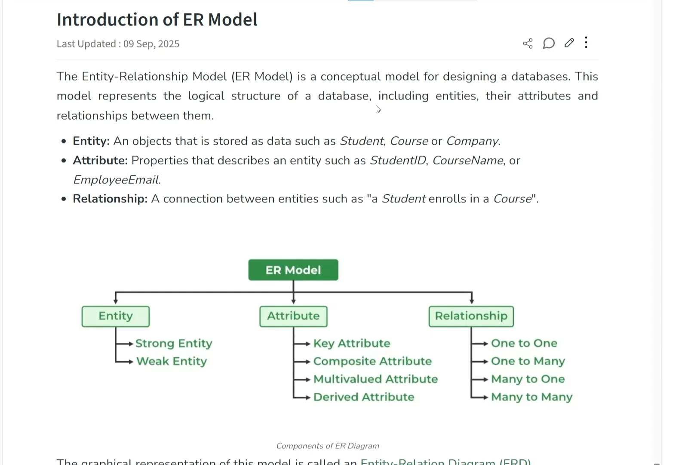
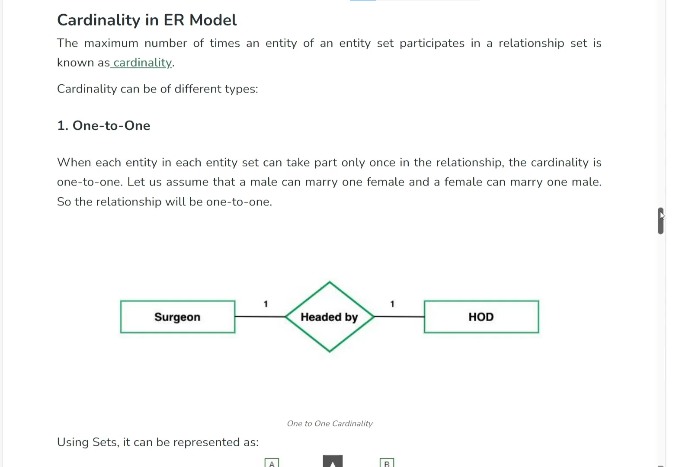
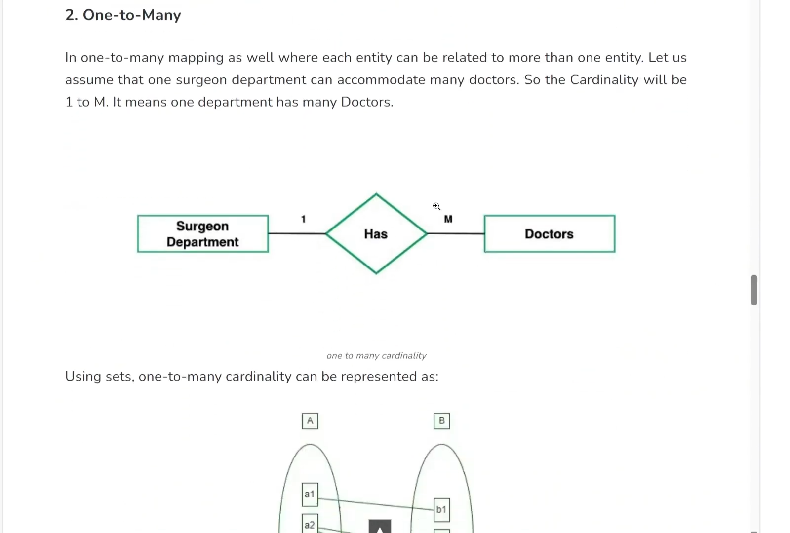
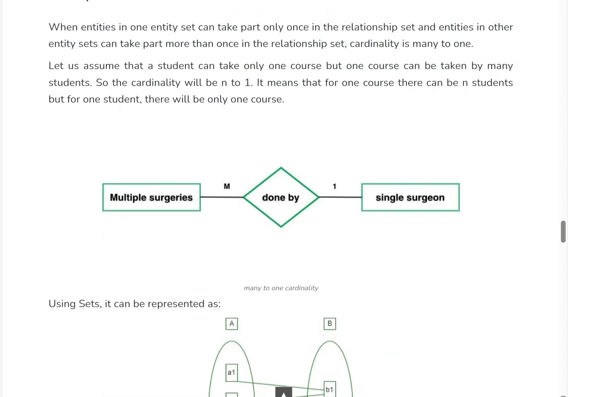
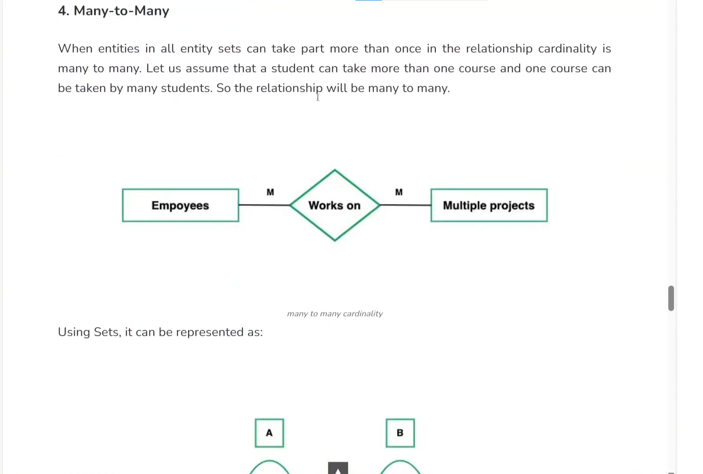
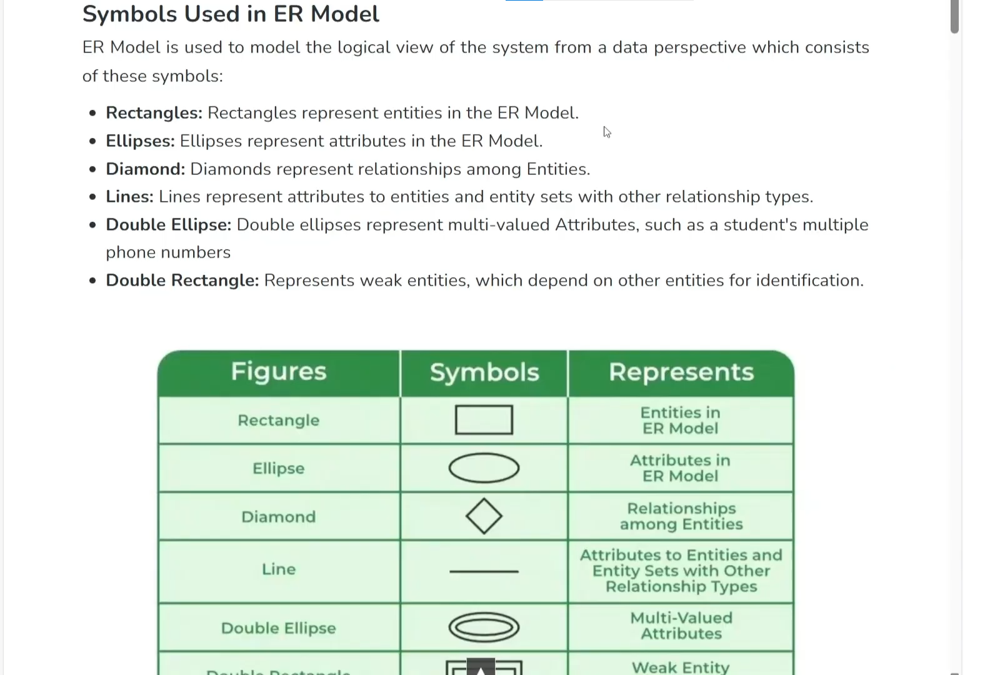
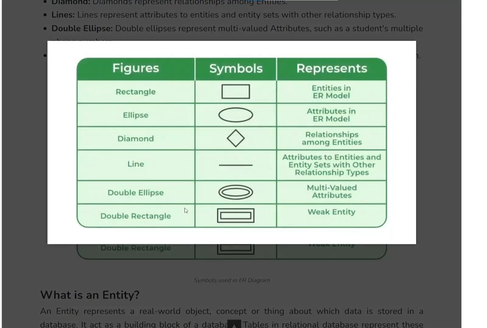

# Cơ sở dữ liệu quan hệ - Phần 3 - Sơ đồ thực thể - quan hệ ERD

*Figure 1: Example of an Entity-Relationship Diagram (ERD)*

## 1. ER Model (ER Diagram) là gì?
- **ER Model** (Entity-Relationship Model) hay **ER Diagram** (Sơ đồ thực thể liên kết) cho phép chúng ta tìm hiểu sâu về bài toán thực tế.
- Giúp tìm ra các thành phần còn thiếu, xác định các mối quan hệ giữa các thực thể và đảm bảo không bị bỏ sót các thuộc tính hoặc thực thể có trong bài toán.
- Mô hình này thường được sử dụng trong **giai đoạn đầu của dự án** (khi tìm hiểu các thành phần và mối quan hệ) và chính là đầu vào cho quá trình chuẩn hóa cơ sở dữ liệu (Normalization).

## 2. Các thành phần chính trong ER Model

*Figure 2: Main Components of the ER Model*

### 2.1. Entity (Thực thể)
- Là các đối tượng (objects) mà chúng ta sẽ lưu trữ thông tin trong hệ thống.
- Thường được tìm ra thông qua việc xác định các danh từ mô tả một thành phần đứng độc lập trong tài liệu yêu cầu bài toán.
- Chia làm 2 loại:
  - **Strong Entity (Thực thể mạnh):** Có thể tồn tại độc lập một mình (Ví dụ: Giỏ hàng - Order).
  - **Weak Entity (Thực thể yếu):** Phụ thuộc vào sự tồn tại của một thực thể khác (Ví dụ: Món hàng trong giỏ - Order Item). Weak entity thường có Composite Key (khóa kết hợp từ nhiều cột), trong đó có Foreign Key trỏ đến bảng khác.

### 2.2. Attribute (Thuộc tính)
- Là đặc tính của một đối tượng. (Nếu danh từ mô tả đặc tính của đối tượng khác, nó là thuộc tính chứ không phải thực thể).
- Các loại thuộc tính đặc biệt:
  - **Key:** Thuộc tính khóa định danh.
  - **Composite:** Thuộc tính có thể chia nhỏ (Ví dụ: Address có thể chia thành Country, State, City, Street).
  - **Multivalue:** Thuộc tính có nhiều giá trị (Ví dụ: Một người có nhiều số điện thoại). Dù vi phạm chuẩn 1NF khi lưu trữ, nhưng trong ER Diagram (giai đoạn phân tích), việc dùng multivalue attribute là bình thường.
  - **Derived (Thuộc tính suy diễn):** Giá trị có thể tính toán được từ thuộc tính khác (Ví dụ: Tuổi có thể tính toán từ Ngày sinh; Tiền phạt tính từ Hạn trả và Ngày trả thực tế).

### 2.3. Relationship (Mối quan hệ)
- Mối liên kết giữa các Entity.
- Các loại quan hệ:
  - **One-to-One (1-1):** Quan hệ một - một.
    
    *Figure 5: One-to-One Relationship*
  - **One-to-Many (1-N):** Quan hệ một - nhiều.
    
    *Figure 6: One-to-Many Relationship*
  - **Many-to-One (N-1):** Quan hệ nhiều - một.
    
    *Figure 7: Many-to-One Relationship*
  - **Many-to-Many (N-M):** Quan hệ nhiều - nhiều.
    
    *Figure 8: Many-to-Many Relationship*

## 3. Các ký hiệu (Sử dụng ký pháp Chen) 

*Figure 3: Chen Notation Symbols*

*Figure 4: ER Diagram Representations*

Ký pháp Chen (Chen notation) là một trong những chuẩn phổ biến nhất để vẽ ER Diagram:
- **Hình chữ nhật:** Biểu diễn các Entity.
  - Cạnh đơn: Strong Entity.
  - Cạnh đôi: Weak Entity.
- **Hình Ellipse (Hình bầu dục):** Biểu diễn Attribute.
  - Tên thuộc tính được gạch chân: Nếu thuộc tính đó là Key.
- **Hình Ellipse đôi:** Biểu diễn Multivalue attribute (Thuộc tính nhiều giá trị).
- **Hình thoi:** Biểu diễn Relationship. Tên trong hình thoi mô tả loại quan hệ.
- **Đường thẳng:** Dùng để nối các Entity với Attribute hoặc nối Entity với Relationship.

*Figure 9: ER Diagram Example - Library Management 1*

## 4. Ví dụ: Bài toán quản lý thư viện đại học

**Yêu cầu:** Xây dựng hệ thống quản lý mượn/trả tài liệu (sách, luận văn) cho độc giả (sinh viên, giảng viên).

**Phân tích các thành phần:**
1. **Thực thể (Entities):**
   - Độc giả (có 2 loại: Sinh viên, Giảng viên).
   - Tài liệu (có 2 loại: Sách, Luận văn - có chung các thuộc tính cơ bản của tài liệu nhưng cũng có thuộc tính riêng).
   - Bản sao tài liệu (Mỗi tài liệu có thể có nhiều bản copy để cho mượn).
   - Thông tin mượn trả (Lịch sử giao dịch).
2. **Mối quan hệ (Relationships):**
   - **Tài liệu** và **Bản sao:** Quan hệ 1-N (Một tài liệu gốc có nhiều bản sao).
   - **Độc giả** và **Bản sao:** Quan hệ N-M thông qua "Thông tin mượn trả". Mỗi độc giả có thể mượn nhiều bản sao, và mỗi bản sao có thể được mượn nhiều lần (bởi các độc giả khác nhau ở các thời điểm khác nhau).
3. **Thuộc tính (Attributes) của Mượn trả:**
   - Bản sao ID.
   - Độc giả ID.
   - Ngày mượn.
   - Hạn trả.
   - Ngày trả thực tế.
   - Tiền phạt: Là một *Derived attribute*, giá trị của nó được tính dựa trên số ngày trễ (Ngày trả thực tế trừ đi Hạn trả).

*Figure 10: ER Diagram Example - Library Management 2*

*Figure 11: ER Diagram Example - Library Management 3*

*Figure 12: ER Diagram Example - Library Management 4*

**Tổng kết:** 
Vẽ ER Diagram giúp chúng ta mường tượng cấu trúc, hiểu kỹ bài toán để tìm ra các thực thể và mối quan hệ. Sau khi có ER Diagram hoàn chỉnh, chúng ta có thể phân tích thành các bảng, chuẩn hóa tối ưu và viết các câu lệnh SQL (DDL) tạo bảng trong hệ quản trị CSDL.
